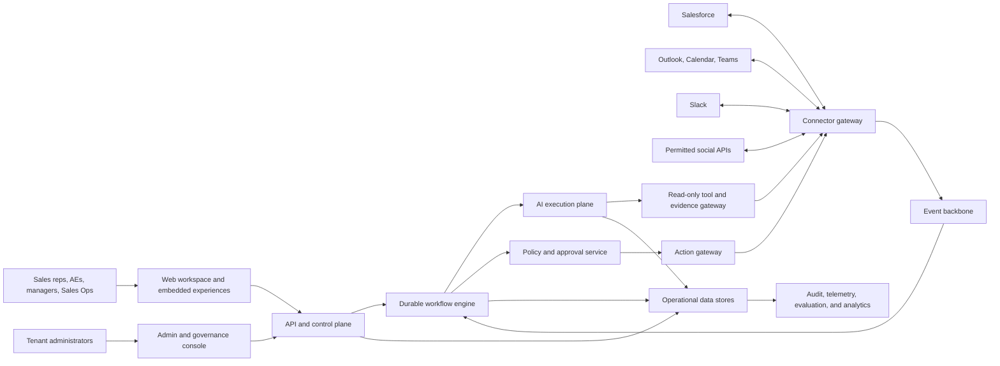

# High-Level Architecture

## Architectural position

Use a **modular control plane plus independently scalable execution workers**. For the prototype, modules share a repository and managed platform to reduce operational overhead. They communicate through versioned APIs and events so high-load or high-risk components can be separated without rewriting business logic.

A microservice per noun is rejected: it would add network, deployment, and data-consistency failure modes before team and load justify them. A single synchronous application is also rejected: connector bursts, durable approvals, model latency, and retries require asynchronous isolation.

## System context

## Major modules

| Module | Responsibility | Scale/isolation |
|---|---|---|
| Edge/API | Authentication, request validation, tenant resolution, UI APIs | Stateless horizontal |
| Tenant control plane | Policy, roles, mappings, templates, connector configuration | Strongly consistent |
| Connector gateway | OAuth/token mediation, provider adapters, rate limits, read/write separation | Partition by provider and tenant |
| Event ingress | Verify signatures, persist raw receipt, deduplicate, acknowledge quickly | Burst-scaled |
| Canonicalisation | Map provider objects/events to versioned domain records | Provider-specific workers |
| Workflow engine | Durable state, timers, retries, compensation, approval waits | Partitioned durable workers |
| Context/evidence service | Authorised retrieval, snapshots, evidence graph, redaction | Tenant/data-class isolated |
| AI execution plane | Agent DAG, model routing, schemas, guardrails, budgets | Queue and workload class |
| Policy decision point | Evaluate permissions, purpose, consent, action risk, retention | Low-latency and fail-closed |
| Approval service | Immutable proposal, reviewer authority, expiry, step-up auth | Strongly consistent |
| Action gateway | Idempotent writes, policy recheck, optimistic concurrency, verification | Provider-specific queues |
| Audit ledger | Tamper-evident security and decision events | Append-only |
| Evaluation service | Datasets, graders, regression gates, shadow/canary analysis | Offline/batch |
| Analytics | Product, quality, business, and cost measures | De-identified/aggregated |

## Deployment view

Recommended initial production platform:

- Azure UK South primary; UK West recovery where service support and contracts permit.
- Managed Kubernetes or equivalent managed container platform for stateless APIs and workers.
- Managed PostgreSQL for configuration, workflow metadata, approvals, and canonical projections.
- Managed event streaming for durable event transport; a schema registry controls compatibility.
- Managed Redis for short-lived cache, distributed rate buckets, and safe ephemeral coordination.
- Object storage for encrypted raw payload quarantine, evaluation artefacts, and permitted transcripts.
- Search/vector layer behind an internal retrieval interface; indexes are tenant-partitioned.
- Managed secrets/key vault; workload identity is preferred to long-lived credentials.
- Warehouse/lakehouse for authorised, minimised analytical data.

Product code depends on internal interfaces, not Azure SDKs, except inside infrastructure and provider adapters. This gives practical portability without pretending every cloud behaves identically.

## Data boundaries

### System of record

- Salesforce owns CRM business records.
- Microsoft 365 owns email, calendar, and Teams content.
- Slack owns Slack messages.
- Social providers own their permitted events/content.
- This product owns workflow state, proposals, approvals, policies, evidence references, evaluation artefacts, and audit.

### Storage classes

1. **Raw ingress quarantine:** encrypted, access restricted, very short retention.
2. **Canonical operational projection:** only fields needed for active workflows.
3. **Evidence snapshots:** immutable references and selectively captured excerpts/hashes required to explain a proposal.
4. **Vector/search index:** derived, tenant partitioned, deletable, never treated as source of truth.
5. **Audit metadata:** long-lived action/decision facts; content redacted or separately retained.
6. **Analytics:** pseudonymised or aggregated where possible.

## Multi-tenancy and scale

Every key, event, cache entry, log, trace, job, metric, and vector includes a non-user-supplied `tenant_id`. Tenant resolution occurs at the trusted edge and is propagated in signed workload context.

Initial pooled deployment:

- PostgreSQL row-level tenant enforcement plus application checks;
- tenant-prefixed object paths and cryptographic context;
- per-tenant event partitions or fair queues;
- per-tenant/provider/model quotas;
- workload concurrency pools by interactive, event, batch, and evaluation class;
- high-cardinality telemetry kept out of globally indexed metric labels.

Enterprise isolation tiers:

- pooled compute with logical data isolation;
- dedicated database/schema and encryption key;
- dedicated execution pool;
- fully dedicated regional deployment for regulated contracts.

Shard before a database or queue reaches sustained hot-spot limits. The shard directory maps tenant to cell. A **cell** contains workflow workers and tenant data dependencies; failure is contained to a bounded tenant set. Global control-plane data remains minimal.

## Consistency and transaction model

There is no distributed transaction across Salesforce, Microsoft, Slack, and this product. Use:

- transactional outbox for local database change plus event publication;
- inbox/deduplication table for received event IDs;
- idempotency key for each external effect;
- optimistic concurrency using provider versions/ETags where available;
- saga state for multi-system action packages;
- read-after-write verification;
- compensation only where semantically safe;
- reconciliation jobs to detect missing or divergent outcomes.

“Exactly once” is not promised. The product provides effectively-once business effects using at-least-once delivery, idempotency, and verification.

## Availability degradation

| Failure | Behaviour |
|---|---|
| AI provider unavailable | Preserve workflow; retry or allow manual completion; never lose source event |
| CRM unavailable | Queue approved actions, show status, respect approval expiry |
| Email unavailable | Do not mark sent; retry and verify using provider identifiers |
| Social API denied | Disable that trigger cleanly; other workflows continue |
| Retrieval incomplete | Lower evidence coverage and abstain where required |
| Policy service unavailable | Fail closed for data access and writes |
| Evaluation/analytics unavailable | Serving continues; release pipeline pauses if gates cannot run |
| Region unavailable | Invoke tested recovery; prevent double execution through fencing |

## Key architectural decisions still requiring validation

- transcript provider and participant-notice process;
- precise Azure services allowed by target customers;
- whether ZDR or customer-managed inference is contractually required;
- tenant-level storage of message bodies versus fetch-on-demand;
- recovery-region legal and service availability;
- social API access granted to the product;
- customer requirements for private networking and dedicated keys.
