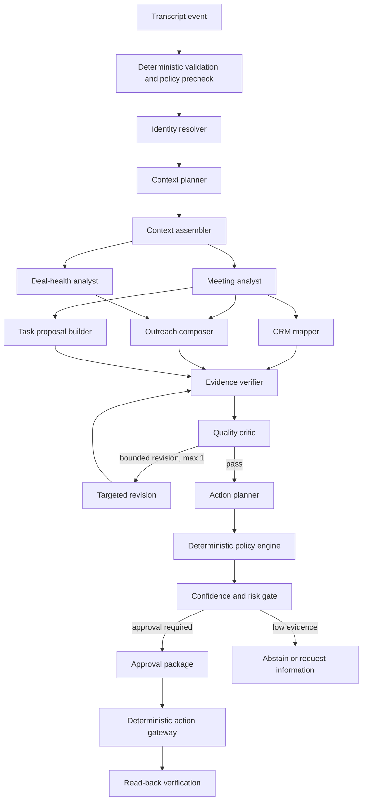
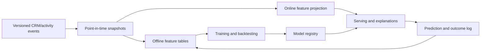

# AI and Multi-Agent Low-Level Design

## Design objective

The AI layer converts authorised enterprise evidence into useful, reviewable proposals. It must be more reliable than a single large prompt and easier to evaluate than an open-ended autonomous swarm.

The architecture is **multi-agent in reasoning, deterministic in control**:

- the workflow engine selects an approved graph;
- specialist agents receive bounded inputs and typed tools;
- agents cannot invent new privileges or bypass graph edges;
- all outputs conform to versioned schemas;
- policy and approval are non-model services;
- the action gateway is the only path to external writes;
- evidence verification and confidence gating occur before a proposal is shown.

## Concrete runtime choice

Initial provider implementation:

- OpenAI Responses API as the model interface;
- OpenAI Agents SDK for bounded agent execution, handoffs where justified, guardrails, usage accounting, and trace instrumentation;
- provider-owned state disabled or minimised where customer retention policy requires it;
- internal model gateway so prompts, schemas, evaluation, policy, and business logic are not tied to one provider;
- `gpt-5.6-terra` as the starting general reasoning model;
- `gpt-5.6-sol` only for difficult planning/verification paths that show measured gain;
- `gpt-5.6-luna` for high-volume, low-risk classification/extraction after task-specific evaluation;
- `text-embedding-3-large` initially for retrieval, with a lower-cost embedding option evaluated before scale rollout;
- immutable model snapshot/version recorded where the provider exposes one.

These are initial evaluation candidates, not permanent hard-coded choices. The model registry selects by capability, risk, latency budget, residency/retention eligibility, and evaluation status. A provider/model is promoted only for a task/version pair.

## Why not one agent

A single agent makes context, permissions, tasks, and quality checks difficult to isolate. It also produces traces that cannot clearly identify whether retrieval, extraction, policy, or writing failed.

## Why not a free-form agent swarm

Unbounded delegation creates unpredictable cost, latency, duplicate tool calls, prompt-injection exposure, and unclear accountability. Parallelism is used only for independent, read-only analysis with explicit fan-out and join limits.

## Agent catalogue

| Agent | Input | Output | Tools | Side effects |
|---|---|---|---|---|
| Intake classifier | Sanitised event metadata/content | workflow type, urgency, hazards | None or taxonomy lookup | None |
| Identity resolver | participant identifiers and candidates | resolved/ambiguous identities | Read-only identity search | None |
| Context planner | task and canonical references | typed retrieval plan | Schema catalogue only | None |
| Context assembler | approved retrieval plan | evidence bundle | Read-only evidence gateway | None |
| Meeting analyst | transcript evidence | facts, commitments, questions, objections | Evidence lookup | None |
| CRM mapper | analysis plus CRM schema | proposed field diffs | Read-only CRM metadata/current values | None |
| Lead analyst | lead evidence/features | qualification and missing evidence | Read-only sources | None |
| Deal-health analyst | feature snapshot and evidence | risk explanation and next actions | Feature/evidence read | None |
| Social-signal analyst | permitted event | signal classification and candidate link | Read-only permitted source | None |
| Outreach composer | approved facts and policy | draft email/message | Template and evidence read | None |
| Action planner | verified outputs | typed proposed-action package | Capability catalogue | None |
| Evidence verifier | claims/actions and evidence | entailed, unsupported, contradicted | Evidence read | None |
| Quality critic | proposal and rubric | defects and required revision | None | None |
| Policy explainer | policy decision codes | user-readable explanation | Policy catalogue | None |

“Compliance agent” is not the final authority. Legal and company rules are executable deterministic policy. A model may classify content or explain a decision, but it cannot grant permission.

## Post-meeting execution graph



Maximum model steps, parallelism, tokens, wall time, tool calls, and revision count are defined per workflow version. Exhausting a budget returns a partial, explicit result rather than silently continuing.

## Agent contract

Each invocation is a signed `AgentRunRequest`:

```json
{
  "run_id": "uuid",
  "workflow_run_id": "uuid",
  "tenant_id": "trusted",
  "agent_type": "meeting_analyst",
  "agent_version": "3",
  "purpose": "sales_follow_up",
  "input_refs": ["evidence:..."],
  "allowed_tools": ["evidence.get_excerpt"],
  "allowed_data_classes": ["internal", "confidential"],
  "output_schema": "MeetingAnalysis.v3",
  "budgets": {
    "max_model_calls": 2,
    "max_tool_calls": 10,
    "max_input_tokens": 80000,
    "max_output_tokens": 8000,
    "deadline_ms": 20000
  },
  "policy_snapshot_id": "policy:...",
  "prompt_version": "sha256:...",
  "model_route": "meeting_analysis_production"
}
```

Outputs contain no executable code. Unknown fields are rejected. Schema failures allow one constrained repair attempt; repeated failure ends the branch.

## Tool gateway

Tools are ordinary application APIs with narrow JSON schemas. They do not expose SQL, raw HTTP, arbitrary search, or credentials.

Example:

```text
crm.get_opportunity(
  opportunity_ref,
  allowed_fields[],
  as_of,
  purpose
) -> {
  record_version,
  fields: [{name, value, evidence_ref, sensitivity}],
  missing_fields[],
  permission_redactions[]
}
```

Tool enforcement sequence:

1. authenticate workload identity;
2. verify tenant and run binding;
3. check tool is allowed for this agent/version;
4. evaluate user/service permissions and purpose;
5. enforce field/row/data-class limits;
6. enforce size, count, time, and cost budget;
7. fetch through connector;
8. sanitise and classify result;
9. create evidence references;
10. log metadata and return typed response.

Tool content is untrusted. Prompt-injection markers do not become instructions. Source text is delimited as data, and no retrieved content can change system policies or tool permissions.

## Evidence and decision trace

### Evidence item

```json
{
  "evidence_id": "uuid",
  "tenant_id": "trusted",
  "source_system": "salesforce",
  "source_object_type": "Opportunity",
  "source_object_id": "opaque",
  "source_version": "etag-or-version",
  "observed_at": "RFC3339",
  "content_locator": {
    "field": "NextStep",
    "start": null,
    "end": null
  },
  "excerpt": "policy-dependent text or null",
  "content_hash": "sha256",
  "author_id": "opaque-or-null",
  "occurred_at": "RFC3339",
  "classification": "confidential",
  "purpose": "sales_follow_up",
  "permissions_snapshot": "uuid",
  "retention_until": "RFC3339"
}
```

### Claim

Every summary sentence, extracted commitment, score explanation, and field update is a `Claim`:

```json
{
  "claim_id": "uuid",
  "text": "Customer asked for a security review before procurement.",
  "claim_type": "customer_requirement",
  "evidence_ids": ["uuid"],
  "entailment": "supported",
  "contradictions": [],
  "importance": "material",
  "confidence": 0.93
}
```

The UI opens the original authorised source at the exact field, message, or transcript time range where provider capabilities allow. If content cannot be retained, the trace stores a cryptographic hash and locator; viewing refetches under the current user's permissions.

### Decision trace

The trace links:

`source event → policy snapshot → retrieval plan → evidence set → features → agent runs → claims → verification → confidence → proposed actions → approval → external receipts → read-back`.

Trace access is itself authorised and audited. Default SDK tracing that may contain raw prompts/tool results is not relied upon as the compliance ledger; sensitive payload capture is disabled or replaced with the internal redacted trace exporter according to tenant policy.

## Confidence: what it means

Do not ask the model “how confident are you?” and treat the answer as probability.

Confidence is a task-specific estimate of **the likelihood that an output will pass its acceptance rubric**, calibrated on representative held-out data.

### Component signals

- extraction/model score where available;
- evidence coverage: material claims with valid citations / all material claims;
- verifier entailment and contradiction scores;
- identity-resolution margin;
- retrieval completeness and freshness;
- schema and business-rule validation;
- agreement between independent deterministic/model checks;
- provider/tool health;
- out-of-distribution and novelty indicators;
- historical accuracy for the exact task, model, prompt, language, and tenant cohort.

### Calibration pipeline

1. Collect human-labelled outcomes using the task rubric.
2. Split by customer/account/time to prevent leakage.
3. Fit a simple calibration mapping such as isotonic regression or logistic/Platt calibration.
4. Measure Brier score, log loss, expected calibration error, and reliability diagrams.
5. Choose thresholds by action risk and the cost of false positives/negatives.
6. Recalibrate after material model, prompt, retrieval, schema, or population change.

### Example risk gate

Thresholds below are starting hypotheses, not universal constants:

| Action | Auto | Human approval | Abstain/escalate |
|---|---:|---:|---:|
| Save internal meeting summary | ≥0.95 and no material contradiction | 0.75–0.95 | <0.75 |
| Create task for approving user | ≥0.97 if tenant enables | 0.75–0.97 | <0.75 |
| Draft external email | Never needs auto-send | ≥0.70 to show draft | <0.70 |
| Send external email | Not automatic in first release | Valid approval plus rechecks | Any failed recheck |
| Change opportunity stage/value | Never automatic | Explicit field-level approval | Missing evidence/conflict |
| Resolve person identity | ≥ task threshold for link suggestion | ambiguous candidate review | no plausible candidate |

Measure **risk-coverage curves**: how accurate the system is as it answers fewer cases. An abstaining model is valuable only if it rejects the right cases.

## Retrieval and grounding

Retrieval follows a typed plan, not an unbounded similarity search.

1. Resolve authorised canonical objects.
2. Fetch current structured CRM fields.
3. Fetch temporally relevant activities/messages.
4. Retrieve tenant playbook/template passages.
5. Apply purpose, permission, retention, and sensitivity filters before ranking.
6. Hybrid rank with structured filters, keyword, vector similarity, recency, and source authority.
7. diversify results and cap per source;
8. return missing/denied context explicitly.

Structured facts remain structured. Embeddings help find relevant text but do not replace record identifiers, dates, amounts, consent, or permission checks.

Indexes are rebuilt/deleted when source permissions or content change. Retrieval evaluation includes relevance, evidence completeness, permission leakage, stale-result rate, and answer-grounding - not only top-k similarity.

## Memory

- **Run memory:** ephemeral evidence for one workflow.
- **User preference:** explicit, editable settings such as tone and preferred task format.
- **Tenant knowledge:** approved playbooks, vocabulary, mappings, and policies with owners and review dates.
- **Conversation state:** retained only for the product purpose and policy window.

The model cannot create durable memory implicitly. Every memory write uses a typed proposal, provenance, owner, retention, and approval/policy path. CRM facts are refetched rather than remembered.

## Feature engineering for deal health

### Feature pipeline



### Rules

- event-time processing with late-event correction;
- every feature has owner, definition, datatype, freshness, lineage, valid range, privacy class, and test;
- training uses only information available at prediction time;
- tenant-specific normalisation where sales cycles differ;
- protected/sensitive traits and obvious proxies are prohibited;
- missingness is explicit, not silently imputed;
- feature values used for a decision are immutable snapshots;
- online/offline parity tests block release;
- labels distinguish “opportunity progressed”, “won”, “lost”, “no decision”, and censoring.

Begin with interpretable rules and learning-to-rank only after sufficient outcomes. Do not optimise directly for revenue without controlling for opportunity size, seller behaviour, seasonality, and selection bias.

## Prompt management

Prompts are code:

- versioned and code reviewed;
- composed from stable policy, task instructions, schemas, and delimited evidence;
- tenant content cannot override system instructions;
- prompt changes linked to evaluation results;
- production alias resolves to immutable version;
- canary and rollback supported;
- no secrets or customer-specific identifiers in source control.

Prompts state: objective, exclusions, evidence rules, uncertainty behaviour, allowed tools, exact output schema, stopping limits, and what requires human judgment.

## Model routing

The router is deterministic and policy-aware. Inputs:

- task and risk tier;
- required modality/tool/schema;
- approved providers for tenant and region;
- data retention/residency mode;
- measured quality floor;
- latency and cost budget;
- current provider health.

Fallback is allowed only to a model already evaluated and approved for that task/data class. A fallback that changes residency or retention is forbidden. Model aliases and deprecation dates are monitored.

## Safety and attack resistance

- retrieved emails, transcripts, CRM notes, and social content are hostile input;
- instruction hierarchy and data delimiters are explicit;
- tools validate semantics independent of the model;
- data-exfiltration canaries and cross-tenant tests run continuously;
- URLs and attachments use malware/content scanning and isolated processing;
- output filters detect secrets, unsupported claims, prohibited terms, and personal/sensitive data;
- recipient and domain checks occur outside the model;
- action summaries show the exact diff;
- high-risk approvals may require step-up authentication and four-eyes review;
- workflow loops, fan-out, tokens, cost, and time are bounded;
- kill switches exist by tenant, workflow, connector, model, prompt, and action type.

## Revision and failure policy

The critic may request one targeted revision with enumerated defects. It cannot start an unbounded debate. If verification still fails:

- retain supported sections;
- mark unsupported sections;
- request missing input or hand off to human;
- record failure taxonomy;
- do not lower the threshold to complete the workflow.

Partial success is explicit. Example: Salesforce task created, email not sent because the connection expired. The UI shows both receipts and remediation.
