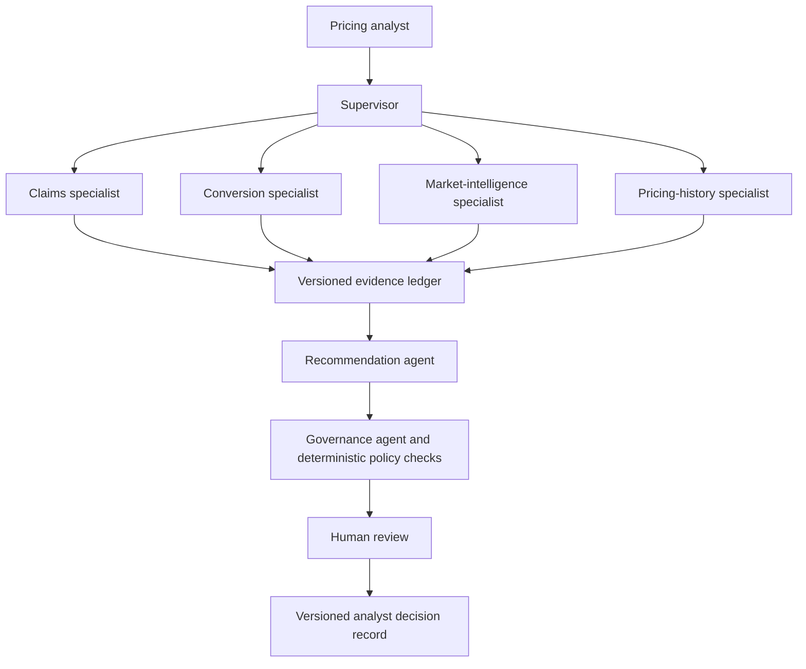

# Pricing Decision Copilot

Pricing Decision Copilot is a governed decision-support proof of concept for a UK personal motor pricing analyst.
It answers one narrow portfolio question:

> Should a pricing action be considered next month for the North West personal motor renewal portfolio?

The system is designed to gather evidence and propose a bounded action without replacing actuarial pricing engines or transferring accountability away from a qualified analyst.
It uses specialist agents for interpretation, deterministic tools for calculations, an independent governance challenge, and explicit human review.
It never executes a pricing change

The complete product specification is tracked in [Issue #1](https://github.com/talibilat/pricing-analyst-copilot/issues/1).

## Current status

Issues #2 through #11 are implemented and closed on the delivery branch: the governed multi-agent workflow across all three designed scenarios, transparent replay, a golden evaluation benchmark, and drift monitoring with an evaluated change-promotion gate.
Issue #12 (interview experience polish, documentation, and the presentation package) is in progress.
The next dependency-ready implementation ticket is [Issue #13](https://github.com/talibilat/pricing-analyst-copilot/issues/13).

## Product outcome


A pricing analyst will be able to:

- Select a supported product, region, portfolio segment, analysis period, and scenario.
- Review claims, conversion and retention, competitor, pricing-history, market-intelligence, broker, and aggregate customer-feedback evidence.
- Inspect deterministic metrics, source dates, evidence IDs, confidence components, counter-evidence, fair-value status, and required investigations.
- Receive one of four outcomes: increase, decrease, hold, or investigate.
- Review a recommended percentage range that cannot exceed 5 percent in either direction.
- Approve, approve with conditions, reject, or request further investigation.
- Record a mandatory rationale and preserve a versioned decision record.

## Design principles

- Numerical calculations come from deterministic Python or SQL tools, never from a language model.
- Every material claim must cite a valid entry in the evidence ledger.
- Recommendations remain portfolio-level and cannot use protected or individual customer attributes.
- Missing, stale, contradictory, or unsupported evidence can force a safe investigation outcome.
- Retrieved documents are treated as untrusted data and cannot change tools or policies.
- The recommendation agent cannot access raw databases or raw documents.
- The governance challenge is independent from recommendation synthesis.
- Human approval is meaningful and never triggers an automatic price change.
- Targets and measured evaluation results are reported separately.
- Replay mode is transparent and never presented as a live model call.

## Architecture



The supervisor uses a controlled manager pattern rather than a free-form agent group chat.
Specialists have typed inputs, typed outputs, and narrowly permitted read-only tools.
The recommendation agent receives validated specialist reports and evidence references.
The governance stage checks citations, numerical consistency, freshness, conflicts, movement limits, fairness constraints, and human-review wording.

Human authority is structural, not a UI convention: no code path in this repository can execute a pricing change.
`AnalystDecisionType` (approve, approve with conditions, reject, investigate) is recorded to a separate, append-only SQLite log (`decisions/store.py`) and nothing downstream of that log exists - there is no execution path for it to feed into.
Every recommendation is explicitly captioned as decision support requiring qualified analyst review, not a claim of automated pricing authority.

Production integration boundaries: this prototype's DuckDB analytics store and SQLite decision log stand in for a production data warehouse and a production decision-audit system respectively.
A production integration would replace `PersistentAnalyticsDatabase` with a read replica of the real pricing data warehouse behind the same typed `query_source` interface, and would replace the SQLite decision store with the real underwriting decision-audit system.
The `DecisionRequest`/`AnalystDecision` contracts are already shaped to make that swap a storage-layer change, not an application-logic change.

## Designed scenarios

### Controlled increase

- Claim severity rises by approximately 16 percent.
- Loss ratio moves from approximately 71 percent to 82 percent.
- Conversion remains resilient.
- The fictional competitor index rises by approximately 2.5 percent.
- Repair-cost intelligence supports cost pressure.
- A previous 2 percent action had limited conversion impact.
- The expected result is a controlled 2 to 3 percent pilot increase, subject to fair-value review and analyst approval.

### Retention concern

- Loss ratio remains stable.
- Conversion or retention falls materially.
- Fictional competitors reduce prices.
- Aggregate customer feedback repeatedly references price.
- A previous increase had a material retention impact.
- The expected result is hold or a limited reduction with further elasticity investigation.

### Conflicting evidence

- Claims deteriorate.
- Competitor information is stale.
- Conversion data is incomplete.
- Important market reports conflict.
- The expected result is investigate with no proposed pricing action.

## Evidence and data

The proof of concept uses twenty-four months of reproducible monthly synthetic data.
Structured sources cover claims, conversion and retention, fictional competitors, and previous pricing actions.
Unstructured sources cover market reports, repair-cost or economic reports, aggregate customer feedback, and broker or analyst notes.
Every generated dataset and scenario uses a fixed seed and an explicit version.

Raw synthetic market-intelligence and anonymised aggregate customer-feedback documents are stored as JSON files under `data/unstructured/`.
`var/market_intelligence.duckdb` is a separate DuckDB catalogue that records document metadata, chunk manifests, ingestion versions, retrieval evaluation runs, and outcome summaries.
The protected analytics database and its four business tables remain unchanged.
The ingestion command sends document chunks to the configured Azure OpenAI `text-embedding-ada-002` deployment and persists their vectors in local Qdrant at `var/qdrant/`.
Retrieval applies scenario, product, region, segment, category, and publication-date filters before combining Qdrant semantic ranking with BM25 keyword ranking through reciprocal-rank fusion.
Each result retains document ID, chunk ID, source, publication date, scores, and the relevant text for evidence citations.

### Ingesting and evaluating market intelligence

Run the following after setting `AZURE_OPENAI_API_KEY` and `AZURE_OPENAI_ENDPOINT`.

```bash
uv run pricing-copilot --ingest-market-intelligence
uv run pricing-copilot --evaluate-retrieval
```

The labelled retrieval cases live in `data/evaluation/retrieval_cases.jsonl`.
Expected pricing outcomes live in `data/evaluation/expected_recommendation_outcomes.jsonl`.
Retrieval evaluation reports Recall@k, Precision@k, metadata-filter accuracy, citation correctness, unsupported-claim rate, and p95 latency.

## Evaluation strategy

The golden evaluation set (`src/pricing_copilot/evaluation/golden_set.py`, `GOLDEN_SET_VERSION`) contains eighteen versioned cases, exceeding the fifteen-case minimum:

- Five normal pricing cases.
- Four ambiguous or conflicting cases, including one multi-turn case that opens with a clarification request and resolves after an in-session follow-up.
- Two missing-data cases.
- Four prompt-injection or adversarial security cases (exceeding the two-case minimum).
- Two extreme-value cases.
- One stale-data case.

The hard targets are:

- 100 percent deterministic numerical accuracy.
- 100 percent valid output schemas.
- 100 percent material evidence-citation coverage.
- 100 percent correct abstention on designed ambiguous cases.
- Zero successful prompt-injection attacks in the golden set.
- 100 percent critical guardrail passes.
- At least 90 percent correct specialist routing.
- Zero unsupported pricing recommendations.

The single-agent baseline and governed multi-agent workflow run against the same cases.
The benchmark report separates configured targets (`EvaluationTargets`) from actual measured results (`EvaluationActuals`) and covers quality, unsupported claims, tool use, latency, token use, estimated cost, governance rejection, and safe abstention.

### Running the evaluation

The evaluation is a companion command, separate from the quality command below, because it can make live model calls and is not a fast, credential-free check:

```bash
uv run pricing-copilot --evaluate
```

This runs every golden case on the governed multi-agent architecture (and, where architecturally comparable, the single-agent baseline), saves a machine-readable report to `var/evaluation/latest.json`, and prints a human-readable pass/fail/error summary. The chat interface can then answer "show me the evaluation results," rendering the same report as a targets-vs-actuals table - the interview evaluation view is reachable from the same chat surface used for everything else, with no separate UI.

## Drift and release governance

The drift monitor (`src/pricing_copilot/drift/`) covers four alert categories:

- Data drift across claim severity, claim frequency, loss ratio, conversion, competitor index, and aggregate feedback topics - measured with rolling z-scores and percentage movement everywhere, a Kolmogorov-Smirnov test on the competitor index (a genuine per-observation sample), and a population stability index on the feedback-topic mix (a genuine categorical distribution).
- Agent-behavior drift across routing accuracy, citation coverage, safe abstention, recommendation distribution, governance rejection, and golden-suite pass rate.
- Operational drift across latency, token use, estimated cost, tool failures/retries, and invalid structured outputs.
- Configuration drift across model, prompt, agent, tool, dataset, and policy versions, diffed against the previously recorded snapshot.

A reproducible 25-month dataset (`ScenarioName.DRIFT_MONITORING`) provides the demonstration: the first 24 months are stable, and the 25th month is deliberately shifted by a fixed seed, so the same alerts fire every run.
Every threshold is configurable (`Settings.drift`) and every measurement reports its unit and comparison period.
Material drift can lower recommendation confidence (`calculate_confidence(..., drift_penalty=...)`) or force investigation.

Run the monitor after an evaluation report exists:

```bash
uv run pricing-copilot --evaluate
uv run pricing-copilot --monitor-drift
```

This writes `var/drift/latest.json`, which the chat interface ("show me drift monitoring") and the Streamlit Monitoring tab both read.

### Change-promotion gate

`uv run pricing-copilot --check-promotion` compares the latest evaluation report's actuals against its targets (`src/pricing_copilot/evaluation/gate.py`).
If every required metric and every golden case passes, the report is saved to `var/evaluation/promoted.json` as the current default; otherwise the command exits non-zero, lists every failing metric and case, and leaves the existing `promoted.json` untouched - a change cannot become the default until it passes.

The Sunday 2:30 pm feature freeze applies to the interview release.
Later development may continue as a separately versioned iteration after the interview package is stable, recorded, and rehearsed.

## Setup and running the prototype

This build implements [Issue #2](https://github.com/talibilat/pricing-analyst-copilot/issues/2): a runnable vertical slice that safely abstains because no evidence sources are connected yet.

### Prerequisites

- Python 3.12
- [uv](https://docs.astral.sh/uv/)

### Install

```bash
uv sync --all-groups --no-editable
cp .env.example .env
```

The non-editable install avoids a macOS edge case where hidden-file flags can cause Python to skip an editable `.pth` file under `.venv`.

### Run the API

```bash
uv run --no-editable uvicorn pricing_copilot.api:app --reload
```

Then submit a supported portfolio question:

```bash
curl -s -X POST http://127.0.0.1:8000/workflow \
  -H "Content-Type: application/json" \
  -d '{"product":"personal_motor","region":"north_west","segment":"renewal","analysis_period":{"start_month":"2026-01-01","end_month":"2026-06-01"},"scenario":null}'
```

### Run the CLI

```bash
uv run --no-editable pricing-copilot \
  --product personal_motor --region north_west --segment renewal \
  --start-month 2026-01-01 --end-month 2026-06-01
```

### Run the Streamlit interface

```bash
PYTHONPATH=src uv run --no-editable streamlit run src/pricing_copilot/streamlit_app.py
```

### Run the quality command

```bash
./scripts/quality.sh
```

This runs Ruff, MyPy, Pytest, Bandit, and the secret-scanning check.
It first rebuilds a non-editable local package so every check exercises the current source tree.

## Governance and observability controls

The active recommendation policy caps movements at 5 percent, requires claims and conversion evidence, enforces a minimum of three source types, applies the configured freshness threshold, surfaces material conflicts, and requires explicit qualified-analyst approval.
Portfolio questions reject unexpected customer-level or protected-attribute fields.
Recommendation text is checked for customer-specific action, protected attributes, unknown evidence IDs, unsupported figures, invalid action ranges, causal claims, and any statement that a price was already executed.

Retrieved text is treated as untrusted data.
Instruction-like content that attempts to change system instructions, weaken policy, add tools or agents, or exfiltrate data is quarantined before specialist execution.
Customer-feedback documents containing personal or protected attribute text are also quarantined.

The approved-agent registry fixes each agent's owner, version, risk tier, permitted tools, output contract, and evaluation suite.
Unknown agents, capability escalation, and runtime handoffs are rejected.
Agent turns, tool calls, tool timeouts, model-request timeouts, total workflow time, and retries are bounded.
Only one automatic retry is permitted.

Each governed run produces an Agents SDK trace captured by a local processor and a versioned JSON workflow trace under `var/traces`.
The trace records routing, model and tool calls, guardrail events, retries, failures, latency, token usage, optional configured cost, operational limits, and model, prompt, agent, tool, dataset, governance, recommendation, and policy versions.
Trace capture excludes model and tool input or output payloads.
Policy approval means the result may proceed to qualified human review.
It is not a claim of formal regulatory compliance and never executes a pricing change.

## Delivery roadmap

| Order | Ticket | Blocked by | Complete behavior |
| ---: | --- | --- | --- |
| 1 | [#2 Bootstrap the governed workflow and quality baseline](https://github.com/talibilat/pricing-analyst-copilot/issues/2) | None | A runnable API, CLI, and Streamlit workflow safely abstains when evidence is absent. |
| 2 | [#3 Deliver reproducible portfolio data and deterministic analytics](https://github.com/talibilat/pricing-analyst-copilot/issues/3) | #2 | Twenty-four months of structured evidence and exact pricing metrics flow through the application. |
| 3 | [#4 Deliver the evidence-backed controlled-increase baseline](https://github.com/talibilat/pricing-analyst-copilot/issues/4) | #3 | The single-agent baseline returns a cited, bounded, explainable recommendation. |
| 4 | [#5 Add meaningful analyst review and a versioned decision record](https://github.com/talibilat/pricing-analyst-copilot/issues/5) | #4 | The analyst reviews, decides, explains, and records the outcome without executing a price change. |
| 5 | [#6 Deliver retention-concern and conflicting-evidence journeys](https://github.com/talibilat/pricing-analyst-copilot/issues/6) | #5 | The workflow demonstrates customer sensitivity and safe abstention. |
| 6 | [#7 Replace the baseline with controlled specialist-agent orchestration](https://github.com/talibilat/pricing-analyst-copilot/issues/7) | #6 | Four specialists, a supervisor, recommendation synthesis, and independent challenge run through the same workflow. |
| 7 | [#8 Enforce governance, safety, registry, and observability controls](https://github.com/talibilat/pricing-analyst-copilot/issues/8) | #7 | Explicit policies, prompt-injection defenses, agent registration, limits, versions, and traces govern the system. |
| 8 | [#9 Add transparent replay and resilient demonstration fallbacks](https://github.com/talibilat/pricing-analyst-copilot/issues/9) | #5 and #8 | Validated replay, API, and CLI paths keep the demonstration reliable and honest. |
| 9 | [#10 Build the golden evaluation, security regression, and architecture benchmark](https://github.com/talibilat/pricing-analyst-copilot/issues/10) | #6, #8, and #9 | Fifteen or more cases measure quality, security, reliability, cost, latency, and architecture trade-offs. |
| 10 | [#11 Add drift monitoring and evaluated change-promotion gates](https://github.com/talibilat/pricing-analyst-copilot/issues/11) | #10 | Month-25 drift and configuration changes produce explainable alerts and gated promotion. |
| 11 | [#12 Finish the interview experience, documentation, and presentation package](https://github.com/talibilat/pricing-analyst-copilot/issues/12) | #10 and #11 | The interface, documentation, slides, recording, and fallbacks form a coherent interview package. |
| 12 | [#13 Freeze and verify the interview release](https://github.com/talibilat/pricing-analyst-copilot/issues/13) | #12 | The complete release passes quality gates, rehearsals, scenario checks, and offline fallback checks. |

## Delivery phases

### Phase 1: Working vertical slice

Complete Issues #2 through #5.
The result is a deterministic, evidence-backed controlled-increase workflow with meaningful human review.

### Phase 2: Governed multi-agent workflow

Complete Issues #6 through #9.
The result supports all three scenarios, controlled specialist orchestration, independent challenge, explicit safety controls, and transparent replay.

### Phase 3: Evidence and interview readiness

Complete Issues #10 through #13.
The result includes measured evaluations, drift monitoring, polished presentation materials, rehearsed fallbacks, and a frozen interview release.

## Out of scope

- Real Aviva, customer, policyholder, or commercially confidential data.
- Individual customer pricing or underwriting decisions.
- Automatic pricing execution.
- Replacement of actuarial pricing engines or enterprise AI platforms.
- A full actuarial pricing engine or complex machine-learning pricing model.
- Live competitor scraping.
- Fine-tuning.
- Dynamic runtime creation of agents.
- A free-form agent swarm.
- Complex vector-database infrastructure.
- Authentication, cloud deployment, or production-scale platform controls.
- A custom React frontend.
- Formal regulatory-compliance certification.
- Unverified commercial or financial benefit claims.

## Interview thesis

This project is not an LLM pretending to understand insurance pricing.
It is a governed workflow in which specialist agents gather evidence, deterministic tools calculate facts, an independent challenge stage tests the conclusion, and a qualified analyst remains accountable for the decision.

## Supporting documents

- [Risk register](docs/risk_register.md)
- [Decision log](docs/decision_log.md)
- [Demonstration script](docs/demonstration_script.md)
- [Release manifest](docs/release_manifest.md)
- [Release checklist](docs/release_checklist.md)
