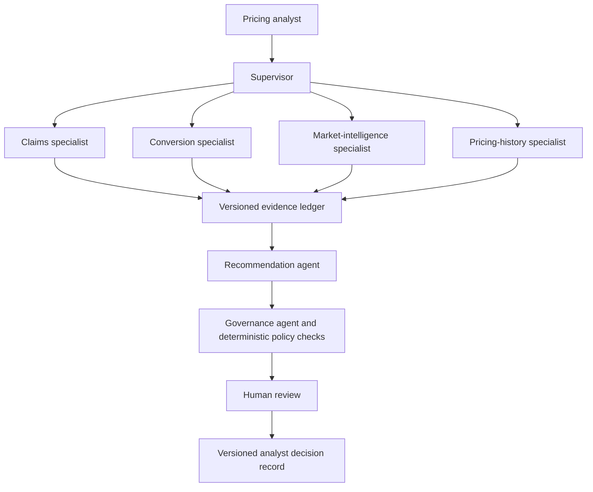

# Pricing Decision Copilot

Pricing Decision Copilot is a governed decision-support proof of concept for a UK personal motor pricing analyst.
It answers one narrow portfolio question:

> Should a pricing action be considered next month for the North West personal motor renewal portfolio?

The system is designed to gather evidence and propose a bounded action without replacing actuarial pricing engines or transferring accountability away from a qualified analyst.
It uses specialist agents for interpretation, deterministic tools for calculations, an independent governance challenge, and explicit human review.
It never executes a pricing change.

The complete product specification is tracked in [Issue #1](https://github.com/talibilat/pricing-analyst-copilot/issues/1).

## Current status

The repository is currently in the planning stage.
Implementation is divided into twelve dependency-aware tracer-bullet tickets.
Each ticket delivers behavior through the same end-to-end workflow and is labeled `ready-for-agent`.

The first available implementation ticket is [Issue #2](https://github.com/talibilat/pricing-analyst-copilot/issues/2).

## Product outcome

A pricing analyst will be able to:

- Select a supported product, region, portfolio segment, analysis period, and scenario.
- Review claims, conversion and retention, competitor, pricing-history, market-intelligence, broker, and aggregate customer-feedback evidence.
- Inspect deterministic metrics, source dates, evidence IDs, confidence components, counter-evidence, fair-value status, and required investigations.
- Receive one of four outcomes: increase, decrease, hold, or investigate.
- Review a recommended percentage range that cannot exceed 5 percent in either direction.
- Approve, approve with conditions, reject, or request further investigation.
- Record a mandatory rationale and preserve a versioned decision record.

## Design principles

- Numerical calculations come from deterministic Python or SQL tools, never from a language model.
- Every material claim must cite a valid entry in the evidence ledger.
- Recommendations remain portfolio-level and cannot use protected or individual customer attributes.
- Missing, stale, contradictory, or unsupported evidence can force a safe investigation outcome.
- Retrieved documents are treated as untrusted data and cannot change tools or policies.
- The recommendation agent cannot access raw databases or raw documents.
- The governance challenge is independent from recommendation synthesis.
- Human approval is meaningful and never triggers an automatic price change.
- Targets and measured evaluation results are reported separately.
- Replay mode is transparent and never presented as a live model call.

## Architecture

The supervisor uses a controlled manager pattern rather than a free-form agent group chat.
Specialists have typed inputs, typed outputs, and narrowly permitted read-only tools.
The recommendation agent receives validated specialist reports and evidence references.
The governance stage checks citations, numerical consistency, freshness, conflicts, movement limits, fairness constraints, and human-review wording.

## Designed scenarios

### Controlled increase

- Claim severity rises by approximately 16 percent.
- Loss ratio moves from approximately 71 percent to 82 percent.
- Conversion remains resilient.
- The fictional competitor index rises by approximately 2.5 percent.
- Repair-cost intelligence supports cost pressure.
- A previous 2 percent action had limited conversion impact.
- The expected result is a controlled 2 to 3 percent pilot increase, subject to fair-value review and analyst approval.

### Retention concern

- Loss ratio remains stable.
- Conversion or retention falls materially.
- Fictional competitors reduce prices.
- Aggregate customer feedback repeatedly references price.
- A previous increase had a material retention impact.
- The expected result is hold or a limited reduction with further elasticity investigation.

### Conflicting evidence

- Claims deteriorate.
- Competitor information is stale.
- Conversion data is incomplete.
- Important market reports conflict.
- The expected result is investigate with no proposed pricing action.

## Evidence and data

The proof of concept uses twenty-four months of reproducible monthly synthetic data.
Structured sources cover claims, conversion and retention, fictional competitors, and previous pricing actions.
Unstructured sources cover market reports, repair-cost or economic reports, aggregate customer feedback, and broker or analyst notes.
Every generated dataset and scenario uses a fixed seed and an explicit version.

Unstructured retrieval starts with metadata filtering and BM25.
Hybrid vector retrieval remains stretch work until the core workflow is stable.

## Evaluation strategy

The golden evaluation set will contain at least fifteen versioned cases:

- Five normal pricing cases.
- Three ambiguous or conflicting cases.
- Two missing-data cases.
- Two prompt-injection cases.
- Two extreme-value cases.
- One stale-data case.

The hard targets are:

- 100 percent deterministic numerical accuracy.
- 100 percent valid output schemas.
- 100 percent material evidence-citation coverage.
- 100 percent correct abstention on designed ambiguous cases.
- Zero successful prompt-injection attacks in the golden set.
- 100 percent critical guardrail passes.
- At least 90 percent correct specialist routing.
- Zero unsupported pricing recommendations.

The single-agent baseline and governed multi-agent workflow will run against the same cases.
The comparison will report quality, unsupported claims, tool use, latency, token use, estimated cost, governance rejection, and safe abstention.

## Drift and release governance

Monitoring covers:

- Data drift across pricing, claims, conversion, competitor, and feedback measures.
- Agent-behavior drift across routing, citations, abstention, recommendation distribution, and governance rejection.
- Operational drift across latency, token use, estimated cost, retries, failures, and invalid outputs.
- Configuration drift across model, prompt, agent, tool, dataset, and policy versions.

A predesigned month-25 dataset provides a repeatable drift demonstration.
Material drift can lower confidence or force investigation.
Changes cannot become the default until the relevant evaluation gates pass.

The Sunday 2:30 pm feature freeze applies to the interview release.
Later development may continue as a separately versioned iteration after the interview package is stable, recorded, and rehearsed.

## Delivery roadmap

| Order | Ticket | Blocked by | Complete behavior |
| ---: | --- | --- | --- |
| 1 | [#2 Bootstrap the governed workflow and quality baseline](https://github.com/talibilat/pricing-analyst-copilot/issues/2) | None | A runnable API, CLI, and Streamlit workflow safely abstains when evidence is absent. |
| 2 | [#3 Deliver reproducible portfolio data and deterministic analytics](https://github.com/talibilat/pricing-analyst-copilot/issues/3) | #2 | Twenty-four months of structured evidence and exact pricing metrics flow through the application. |
| 3 | [#4 Deliver the evidence-backed controlled-increase baseline](https://github.com/talibilat/pricing-analyst-copilot/issues/4) | #3 | The single-agent baseline returns a cited, bounded, explainable recommendation. |
| 4 | [#5 Add meaningful analyst review and a versioned decision record](https://github.com/talibilat/pricing-analyst-copilot/issues/5) | #4 | The analyst reviews, decides, explains, and records the outcome without executing a price change. |
| 5 | [#6 Deliver retention-concern and conflicting-evidence journeys](https://github.com/talibilat/pricing-analyst-copilot/issues/6) | #5 | The workflow demonstrates customer sensitivity and safe abstention. |
| 6 | [#7 Replace the baseline with controlled specialist-agent orchestration](https://github.com/talibilat/pricing-analyst-copilot/issues/7) | #6 | Four specialists, a supervisor, recommendation synthesis, and independent challenge run through the same workflow. |
| 7 | [#8 Enforce governance, safety, registry, and observability controls](https://github.com/talibilat/pricing-analyst-copilot/issues/8) | #7 | Explicit policies, prompt-injection defenses, agent registration, limits, versions, and traces govern the system. |
| 8 | [#9 Add transparent replay and resilient demonstration fallbacks](https://github.com/talibilat/pricing-analyst-copilot/issues/9) | #5 and #8 | Validated replay, API, and CLI paths keep the demonstration reliable and honest. |
| 9 | [#10 Build the golden evaluation, security regression, and architecture benchmark](https://github.com/talibilat/pricing-analyst-copilot/issues/10) | #6, #8, and #9 | Fifteen or more cases measure quality, security, reliability, cost, latency, and architecture trade-offs. |
| 10 | [#11 Add drift monitoring and evaluated change-promotion gates](https://github.com/talibilat/pricing-analyst-copilot/issues/11) | #10 | Month-25 drift and configuration changes produce explainable alerts and gated promotion. |
| 11 | [#12 Finish the interview experience, documentation, and presentation package](https://github.com/talibilat/pricing-analyst-copilot/issues/12) | #10 and #11 | The interface, documentation, slides, recording, and fallbacks form a coherent interview package. |
| 12 | [#13 Freeze and verify the interview release](https://github.com/talibilat/pricing-analyst-copilot/issues/13) | #12 | The complete release passes quality gates, rehearsals, scenario checks, and offline fallback checks. |

## Delivery phases

### Phase 1: Working vertical slice

Complete Issues #2 through #5.
The result is a deterministic, evidence-backed controlled-increase workflow with meaningful human review.

### Phase 2: Governed multi-agent workflow

Complete Issues #6 through #9.
The result supports all three scenarios, controlled specialist orchestration, independent challenge, explicit safety controls, and transparent replay.

### Phase 3: Evidence and interview readiness

Complete Issues #10 through #13.
The result includes measured evaluations, drift monitoring, polished presentation materials, rehearsed fallbacks, and a frozen interview release.

## Out of scope

- Real Aviva, customer, policyholder, or commercially confidential data.
- Individual customer pricing or underwriting decisions.
- Automatic pricing execution.
- Replacement of actuarial pricing engines or enterprise AI platforms.
- A full actuarial pricing engine or complex machine-learning pricing model.
- Live competitor scraping.
- Fine-tuning.
- Dynamic runtime creation of agents.
- A free-form agent swarm.
- Complex vector-database infrastructure.
- Authentication, cloud deployment, or production-scale platform controls.
- A custom React frontend.
- Formal regulatory-compliance certification.
- Unverified commercial or financial benefit claims.

## Interview thesis

This project is not an LLM pretending to understand insurance pricing.
It is a governed workflow in which specialist agents gather evidence, deterministic tools calculate facts, an independent challenge stage tests the conclusion, and a qualified analyst remains accountable for the decision.
