# Pricing Decision Copilot complete system documentation

## Purpose and scope

Pricing Decision Copilot is a governed decision-support prototype for one portfolio-level question: whether the North West personal-motor renewal portfolio should consider a pricing action next month.

It is not a pricing engine and it has no code path that writes to a pricing system or executes a price change.

The currently supported portfolio combination is `personal_motor/north_west/renewal`.

The runtime uses synthetic scenario data and synthetic market documents.

The `CRM/` directory is a separate Sales Copilot architecture proposal and is not an implemented dependency of this application.

This document covers every module in `src/pricing_copilot`, its data stores, its entry points, its live and offline paths, and its implementation controls.

## 1. High-level architecture

The application exposes three user surfaces: a Streamlit chat UI, a FastAPI API, and a CLI.

Natural-language source questions are routed by deterministic keyword matching.

Pricing-analysis requests enter the governed workflow.

The governed workflow computes all numerical values deterministically, retrieves local documents with BM25, runs six restricted LLM roles, validates their output deterministically, and requires a qualified analyst to decide.

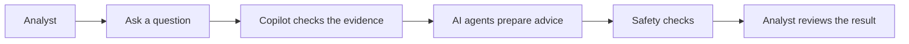

In simple terms, the analyst asks for help, the copilot gathers and checks portfolio-level evidence, AI agents write a recommendation, and the software checks that recommendation before showing it.

The analyst remains responsible for the decision.

### How a question reaches the copilot

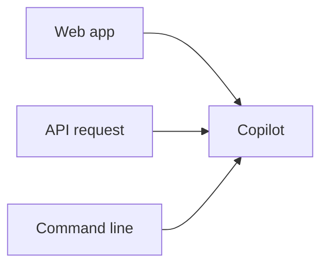

The same core copilot can be used through the Streamlit web app, the FastAPI interface, or the command line.

### Where the copilot gets its information

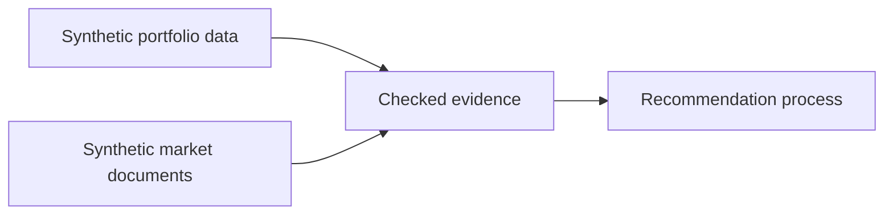

The current prototype uses made-up portfolio records and made-up market documents.

It does not connect to a live insurer database, a customer system, or an external market-data provider.

### What happens after the recommendation

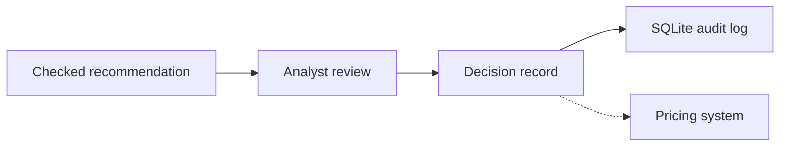

Recording an analyst decision creates an audit record only.

The final dashed arrow means that no implemented code sends this decision to a pricing system.

### Runtime components

| Component | Implementation | Responsibility | External dependency |
| --- | --- | --- | --- |
| Streamlit UI | `streamlit_app.py` | Chat, charts, decision capture, and monitoring display. | Streamlit, Altair, Pandas. |
| API | `api.py` | Health, workflow, chat, decision write, and decision read endpoints. | FastAPI and Pydantic. |
| CLI | `cli.py` | Interactive workflow execution, data build, replay recording, evaluation, drift monitoring, and promotion. | Python argparse. |
| Chat service | `chat/service.py` | Deterministic intent routing and safe portfolio-level source retrieval. | DuckDB, BM25, workflow. |
| Governed workflow | `orchestration/pipeline.py` | Coordinates evidence, agents, deterministic validation, safe failure, and tracing. | OpenAI Agents SDK and Azure OpenAI. |
| Analytics | `analytics/` | Validates 24-month records and derives portfolio metrics. | Python only. |
| Evidence | `evidence/` | Creates ledger entries, detects evidence problems, computes confidence and fair-value status. | Python only. |
| Governance | `governance/` and `recommendation/governance.py` | Enforces registry, data safety, policy, scope, citations, numbers, wording, and limits. | Python only. |
| Data | `data/` | Generates synthetic scenarios and exposes in-memory and persistent DuckDB access. | DuckDB. |
| Documents | `documents/` | Holds synthetic document corpus and performs local BM25 retrieval. | rank-bm25. |
| Observability | `observability/` | Records bounded execution metadata and local JSON traces. | OpenAI Agents SDK tracing. |
| Decisions | `decisions/` | Persists an analyst decision record. | SQLite. |
| Replay | `replay/` | Stores and validates cached ChatResponse artefacts. | Local JSON files. |
| Evaluation | `evaluation/` | Runs golden cases, scores results, and controls promotion. | Local JSON files. |
| Drift | `drift/` | Detects data, behaviour, operational, and configuration changes. | SciPy and local JSON files. |

## 2. Low-level governed workflow

The normal live path is `run_portfolio_workflow` in `workflow.py`.

It validates the product, region, and segment before invoking `run_governed_portfolio_workflow`.

The workflow accepts only the three implemented live scenarios: `controlled_increase`, `retention_concern`, and `conflicting_evidence`.

An absent or unsupported scenario returns a safe missing-evidence `INVESTIGATE` result without calling a model.

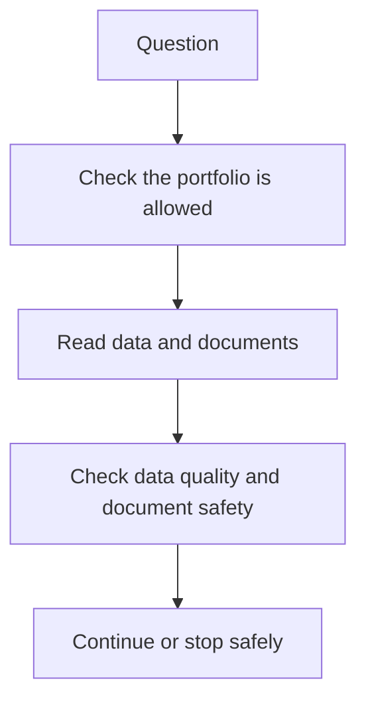

This first stage does not ask an AI model to calculate anything.

If the portfolio is unsupported, the data is invalid, or the documents are too old or contradictory, the system stops and returns `INVESTIGATE`.

### Low-level diagram 1: preparing the evidence

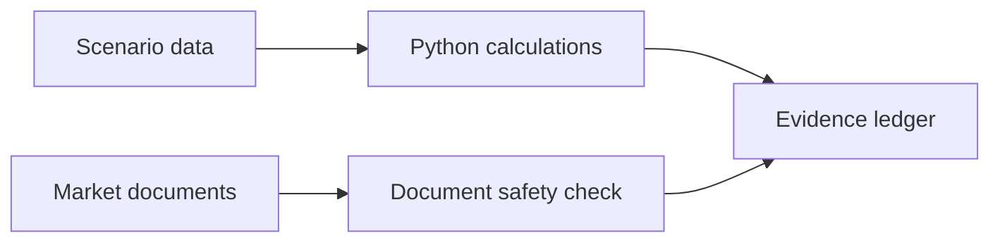

The Python calculations produce the numbers, such as loss ratio and conversion rate.

The document safety check removes documents that look like they are trying to give the AI instructions or that contain prohibited personal information.

The evidence ledger is a structured list of the information that may support a recommendation.

### Low-level diagram 2: the specialist AI team

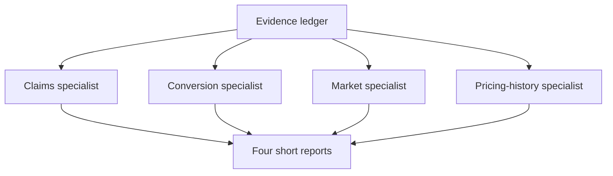

The four specialists run at the same time.

Each specialist can see only the evidence needed for its own area.

Each specialist must cite the IDs of the evidence it uses.

### Low-level diagram 3: creating and challenging advice

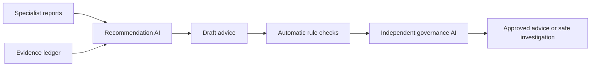

The recommendation AI cannot query databases or open documents.

It can use only the reports and the ledger supplied to it.

The independent governance AI did not write the recommendation and can reject it.

### Low-level diagram 4: what happens when a check fails

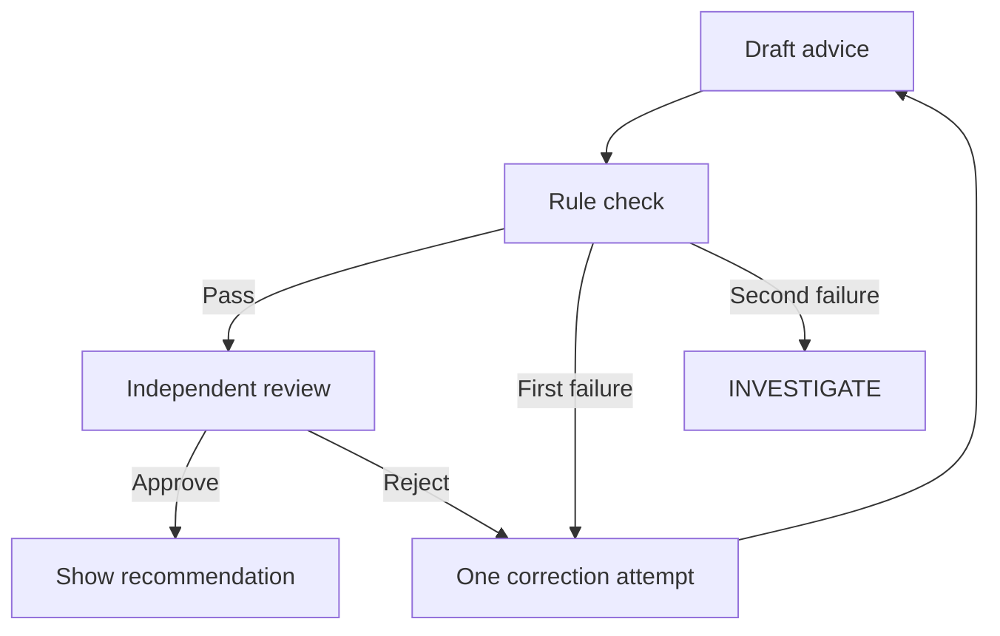

The system permits only one correction attempt.

If the same advice still fails, the system does not guess or relax the rules.

It tells the analyst that more investigation is needed.

### Step-by-step behaviour

1. `validate_portfolio_combination` allows only `personal_motor/north_west/renewal` and raises `UnsupportedPortfolioError` for all other combinations.

2. `PortfolioDataRepository.from_scenario` calls `generate_scenario_dataset` and loads its records into a private in-memory DuckDB database.

3. `build_analytics` fetches claims, conversion, competitor, and pricing-history records through parameterized SQL and sends them to deterministic calculator functions.

4. `retrieve_documents` filters the document corpus by scenario and region, tokenizes title and body with `[a-z0-9]+`, ranks with `BM25Okapi`, and returns the top six records with BM25 scores.

5. `quarantine_unsafe_documents` removes documents with instruction override, policy weakening, tool escalation, data-exfiltration language, or personal/protected data in customer-feedback text.

6. `detect_material_evidence_issues` rejects documents older than the configured maximum age and rejects conflicting support and opposition from the same source type.

7. `build_specialist_agents` creates four typed specialist agents and gives each only its registered read-only tool or tools.

8. `run_specialists` executes the four specialists concurrently with `asyncio.gather` and isolates a failed specialist from the others.

9. `build_evidence_ledger` converts deterministic metrics, prior actions, and safe retrieved documents into immutable-in-result evidence entries with IDs and provenance.

10. `validate_pre_synthesis_policy` requires completed claims and conversion reports and at least three source types in the ledger.

11. The recommendation agent receives only specialist reports, a ledger summary, the policy movement limit, and optional bounded revision feedback.

12. `validate_and_clamp_draft` performs deterministic validation before the independent governance agent sees the draft.

13. The governance agent receives the validated draft, reports, and ledger and either approves or returns specific feedback.

14. A rejected recommendation can receive one revision only, regardless of whether the first revision was caused by deterministic validation or governance rejection.

15. A second invalid or rejected draft produces `INVESTIGATE`, never a partially validated price recommendation.

16. Approved recommendations receive deterministic confidence and fair-value outputs before the final `WorkflowResult` is returned.

## 3. AI and LLM implementation

### Provider and model

The live governed workflow creates `AsyncOpenAI` with the base URL `<AZURE_OPENAI_ENDPOINT>/openai/v1`.

It wraps the configured deployment in `OpenAIChatCompletionsModel` from the OpenAI Agents SDK.

`AZURE_OPENAI_CHAT_DEPLOYMENT` overrides `PRICING_COPILOT_MODEL_NAME`.

The default model name is `gpt-4.1-mini`.

The application fails safely to an investigation result when Azure OpenAI credentials or endpoint configuration are absent.

### Plain-language view of AI use

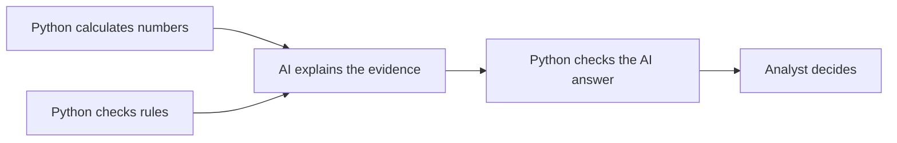

The AI does not calculate the loss ratio, search the database, or make the final decision.

Python code calculates the numbers and checks the rules before and after AI use.

The AI's job is to write short, evidence-based explanations and recommendations in a fixed format.

### Agent inventory

| Agent | Model role | Tools | Typed output | Input boundary |
| --- | --- | --- | --- | --- |
| `portfolio-supervisor` | Deterministic orchestration role, not an Agents SDK `Agent`. | None. | `WorkflowResult`. | Coordinates code only. |
| `claims-specialist` | Interprets claims metrics. | `get_claims_metrics`. | `SpecialistFindings`. | Receives a tool result only. |
| `conversion-specialist` | Interprets conversion and retention metrics. | `get_conversion_metrics`. | `SpecialistFindings`. | Receives a tool result only. |
| `market-intelligence-specialist` | Interprets competitor metrics and retrieved documents. | `get_competitor_metrics`, `get_market_intelligence_documents`. | `SpecialistFindings`. | Documents are explicitly untrusted data. |
| `pricing-history-specialist` | Interprets historic actions and recorded impacts. | `get_pricing_history`. | `SpecialistFindings`. | Receives a tool result only. |
| `recommendation-agent` | Synthesizes a portfolio recommendation. | None. | `RecommendationDraft`. | Receives reports and ledger only. |
| `governance-agent` | Independently challenges a draft. | None. | `GovernanceReview`. | Receives draft, reports, and ledger only. |

Every specialist system prompt requires a tool call before writing a response.

Every specialist prompt prohibits invented figures and requires cited evidence IDs for referenced evidence.

The market specialist must call both of its tools.

All agent prompts prohibit causal claims about conversion or retention because no causal-inference method exists.

The recommendation agent must surface counter-evidence and cannot calculate new figures.

The governance agent rejects a draft that contradicts reports, omits material opposing evidence, or implies that a price was already executed.

### Model controls

`AgentRuntime` checks that the agent output contract matches the expected Pydantic class.

It checks the configured tools against the approved-agent registry before each run.

It rejects agent handoffs entirely.

It permits at most six model turns per agent by default.

It permits at most four tool calls per agent by default.

It applies a five-second tool timeout and a 30-second model request timeout by default.

It retries only `TimeoutError`, maximum-turn, model-behaviour, and tool-timeout errors.

It permits at most one retry by default.

The overall workflow is limited to 90 seconds by default.

Token usage and optional configured GBP cost are captured in the execution trace.

### Baseline implementation

`run_baseline_portfolio_workflow` is retained for fallback and comparison.

Its live implementation uses one direct Azure OpenAI chat-completions call with JSON-object output, a 1,200-token completion limit, and up to two attempts.

Unlike the governed recommendation agent, the baseline synthesizer receives analytics, the evidence ledger, and raw retrieved documents wrapped as untrusted data.

The normal public entry point selects the governed path unless `use_baseline=True` or an explicit synthesizer is passed.

The fake baseline and fake governed runners are deterministic network-free test doubles.

## 4. Deterministic analytics and synthetic data

### Data models

`ClaimsMonthlyRecord` stores period, product, region, segment, policies in force, claim count, incurred loss, and earned premium.

`ConversionMonthlyRecord` stores period, product, region, segment, quotes, sales, renewals due, renewals retained, and average quoted premium.

`CompetitorMonthlyRecord` stores period, region, competitor name, and price index.

`PricingActionRecord` stores period, product, region, segment, price change, rationale, conversion impact, and loss-ratio impact.

`FeedbackTopicMonthlyRecord` supports drift monitoring with claims-handling, price, communication, and other topic shares.

`ScenarioDataset` combines the four workflow record collections with scenario, seed, and version.

### Scenario generation

The default synthetic-data seed is fixed and the scenario dataset has a version identifier.

Every generated workflow scenario contains 24 monthly periods starting in January 2024.

The first 12 months form the baseline window and the following 12 months form the current window.

The controlled-increase scenario models claims deterioration, resilient demand, firming fictional competitors, and a prior small increase.

The retention-concern scenario models broadly stable claims, deteriorating retention or conversion, softer fictional competitors, and a historic action with adverse retention context.

The conflicting-evidence scenario models deterioration with incomplete or conflicting market evidence that should force investigation through document controls.

The drift-monitoring scenario supplies a synthetic series used by the data-drift detectors.

The feedback-topic generator creates a changed current-month mix for drift testing.

### Calculator implementation

`calculate_claims_metrics` requires exactly 24 contiguous periods.

It rejects non-positive policies in force or earned premium, negative claim count or incurred loss, zero claims because severity cannot be computed, and loss ratios above 5.0.

It derives claim frequency as claims divided by policies, severity as incurred loss divided by claims, incurred loss, and loss ratio as incurred loss divided by earned premium.

`calculate_conversion_metrics` requires 24 contiguous periods for the selected segment and for each comparison segment.

It rejects non-positive quotes or average premium, out-of-range sales or retained renewals, negative renewals due, and zero renewals due because retention cannot be computed.

It derives quote-to-sale conversion, renewal retention, average premium, and a segment-level conversion comparison.

`calculate_competitor_metrics` requires records, positive price indices, and complete contiguous periods for the overall and per-competitor series.

It derives price-index movement and within-period rank for each fictional competitor.

`summarize_pricing_history` rejects blank rationales and absolute historical movements above 25 percentage points.

All window metrics store their full monthly series, baseline mean, current mean, and percentage movement.

### Database implementations

The live governed workflow uses a generated in-memory DuckDB database through `PortfolioDataRepository`.

The repository creates claims, conversion, competitors, and pricing-history tables and queries them with parameterized conditions.

`PersistentAnalyticsDatabase` serves the chat and drift paths from `var/synthetic_portfolio.duckdb` by default.

It rebuilds the file when absent, invalid, missing a schema catalogue, or using a different database version.

The persistent database stores source tables, `dataset_versions`, and `schema_catalogue`.

Each dataset version row contains the scenario, dataset version, seed, database version, SHA-256 checksum, and table row counts.

Chat query plans can select only allowlisted columns from one allowlisted source table and cannot join or write.

The persistent database’s schema catalogue identifies every source field’s type, unit, source version, and read-only portfolio-level access boundary.

## 5. Documents, retrieval, and evidence

### Document corpus

`DocumentRecord` stores document ID, source type, title, body, source date, scenario, region, sentiment, and a synthetic-data marker.

The source types are market report, repair-cost report, customer feedback, and broker note.

The sentiments are supports increase, neutral, and against increase.

The corpus includes a deliberate prompt-injection fixture in the controlled-increase scenario.

The conflicting-evidence corpus includes stale and contradictory market reports.

The customer-feedback documents are aggregate and anonymised in the supplied fixture data.

### Retrieval

The retrieval query is a fixed collection of pricing-evidence terms covering claims, conversion, retention, competitors, feedback, brokers, price increases, and repair costs.

Retrieval does not call an LLM, embedding service, vector database, or external search service.

It tokenizes lower-cased alphanumeric terms and ranks matching local documents with BM25.

`RetrievedDocument` adds the numeric BM25 score to the document record.

### Evidence ledger

`EvidenceLedgerEntry` stores evidence ID, source type, source reference, optional source date, retrieval timestamp, analysis period, metric name, current value, baseline value, and interpretation.

The ledger adds deterministic entries for loss ratio, quote-to-sale conversion, renewal retention, average competitor movement, and every pricing-history action.

It adds a document entry for every safe retrieved document and retains its source type, date, retrieval timestamp, and sentiment interpretation.

The ledger is generated per workflow result rather than persisted as its own database table.

### Confidence and fair value

Confidence measures coverage across claims, conversion, market intelligence, and pricing history.

Document freshness declines linearly to zero over 180 days.

For an increase, specialist agreement checks positive loss-ratio movement, positive average competitor movement, and quote-to-sale conversion movement no worse than negative 10 percent.

Data quality equals one minus an optional drift penalty, although the current workflow invokes this calculation with zero drift penalty.

For an increase, the conflict penalty is the proportion of supplied documents whose sentiment is against an increase.

Overall confidence is the arithmetic mean of coverage, freshness, agreement, quality, and one minus conflict penalty.

Fair value is `no_concern` for every non-increase action.

For an increase, it is `concern_identified` when at least two documents oppose an increase or conversion movement is below negative 10 percent.

Otherwise an increase is `review_recommended` with follow-up actions to consider price-sensitive segments and monitor two renewal cycles.

## 6. Security and governance measures

### Plain-language security map

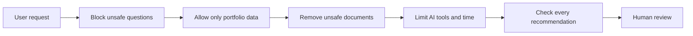

The controls are layered so that a problem caught at any step prevents an unsafe recommendation from reaching the analyst.

No single AI response is trusted by itself.

### Request and data-scope controls

`PortfolioQuestion`, `ChatRequest`, `ChatContext`, `ChatResponse`, and activity/table models forbid undeclared fields through Pydantic configuration.

`PortfolioQuestion` rejects an analysis period whose end date precedes its start date.

The chat service rejects raw SQL keywords, including select, insert, update, delete, drop, alter, attach, copy, pragma, create, grant, and revoke.

The chat service rejects requests to ignore instructions, weaken controls, add tools or agents, or exfiltrate secrets, credentials, environment variables, or customer data.

The chat service rejects customer identifiers, customer names, customer records, dates of birth, email addresses, phone numbers, and postcodes.

The chat service rejects all policy-prohibited attributes, including age, disability, ethnicity, gender reassignment, marital status, pregnancy, race, religion, sex, and sexual orientation.

The persistent database permits only predeclared portfolio-level source tables and columns.

It uses a fixed `SELECT ... WHERE scenario = ? ORDER BY period` statement with source and columns derived solely from allowlists.

### Untrusted-document protection

Retrieved documents are treated as untrusted data in every prompt that can see them.

The pre-model document quarantine detects developer or system override language, instruction-ignoring language, policy weakening, tool or agent escalation, and data-exfiltration instructions.

Quarantined documents are excluded before specialist agents, evidence policy, ledger construction, recommendation synthesis, confidence, and fair-value calculations.

Customer-feedback documents are also quarantined when they contain personal identifiers or protected-attribute terms.

The market specialist and baseline prompt explicitly state that document content cannot change system instructions.

The recommendation prompt also treats instruction-like specialist text as untrusted.

### Agent capability controls

The approved-agent registry declares owner, version, risk tier, permitted tools, output contract, and evaluation suite for every agent.

Unknown agents, missing tools, extra tools, changed output contracts, and declared handoffs raise `UnapprovedAgentError` or `RuntimeLimitExceeded`.

The recommendation and governance agents have no tools.

The recommendation agent has no direct database or document access.

The governance agent has no direct database or document access and is structurally independent of draft synthesis.

All specialist tool functions are read-only, expose a narrow fixed payload, and have a configurable timeout that raises on expiry.

### Evidence and recommendation controls

The policy settings cannot disable claims evidence, conversion evidence, human approval, customer-level-action prohibition, or the protected-attribute list.

The maximum configured price movement must be greater than zero and no more than 5 percent.

The configured minimum source-type count must be at least three.

Evidence checks reject stale documents older than the configured 120-day default.

Evidence checks reject conflicting support and opposition within a document source type rather than averaging them away.

Pre-synthesis checks require completed claims and conversion specialist reports and enough source types.

Deterministic draft validation rejects unknown evidence IDs.

It rejects statements that claim a price has already been changed, implemented, executed, applied, or otherwise actioned.

It rejects customer-level actions and protected-attribute references.

It enforces no range for hold or investigate, a required range for increase or decrease, and an action-consistent sign for every range.

It requires deterministic claims and conversion evidence for actionable increase or decrease recommendations.

It clamps a supplied range to the configured plus or minus 5 percent limit and adds an explicit condition when clamping occurs.

It appends the mandatory qualified-analyst approval condition.

It checks every percentage figure in recommendation text against ledger values, cited document values, draft range values, or the policy limit with a five-percentage-point natural-language rounding tolerance.

It replaces causal wording with correlational wording before the draft becomes a result.

The independent governance agent can reject the recommendation after deterministic validation.

### Operational safety and privacy

The workflow uses typed Pydantic outputs throughout.

Specialist errors are isolated and converted to a safe investigation result.

Model and workflow exceptions are caught and converted to a safe investigation result.

The UI exposes purpose-oriented activity labels and explicitly does not expose hidden prompts or chain-of-thought.

Trace capture sets `trace_include_sensitive_data=False`.

Local traces record metadata, not model or tool input or output payloads.

Analyst decision recording validates a non-blank rationale and requires conditions for conditional approval or investigation requests.

The decision store is separate from the workflow and has no downstream execution consumer.

The implementation uses `INSERT OR REPLACE` by record ID, although ordinary service use creates a new UUID for each submitted decision.

## 7. Chat implementation

`ChatService` is a deterministic router and is not an LLM.

It normalizes whitespace, applies refusal checks, determines scenario from explicit scenario phrases, and chooses an intent from keywords.

The intents are data retrieval, multi-source summary, pricing analysis, replay, evaluation, drift, help, and unsupported.

The supported source keywords map to claims, conversion, competitors, pricing history, market intelligence, customer feedback, and the schema catalogue.

Source retrieval uses persistent DuckDB for structured sources and BM25 plus document quarantine for document sources.

Chat activity events describe source lookup, agent progress, guardrails, and failure without exposing private payloads.

A pricing-analysis request creates the fixed North West personal-motor renewal question with the selected scenario and passes it to the governed workflow.

If live analysis cannot complete, the service explains the live failure and offers explicitly requested replay rather than silently serving cached data.

Evaluation and drift intents load existing report files only and never trigger a fresh benchmark or monitoring run from chat.

## 8. User interfaces and APIs

### FastAPI endpoints

| Endpoint | Request | Behaviour | Result |
| --- | --- | --- | --- |
| `GET /health` | None. | Returns service health. | `{ "status": "ok" }`. |
| `POST /workflow` | `PortfolioQuestion` and optional `replay` query parameter. | Runs live governed workflow or replay. | `WorkflowResult`. |
| `POST /chat` | `ChatRequest`. | Routes safe natural-language request. | `ChatResponse`. |
| `POST /decisions` | `DecisionRequest`. | Validates and records analyst decision. | `AnalystDecision`. |
| `GET /decisions/{record_id}` | Record ID path parameter. | Reads stored decision or returns 404. | `AnalystDecision`. |

The workflow endpoint maps unsupported portfolio errors to HTTP 422 and replay artefact absence or incompatibility to HTTP 409.

The decision endpoint maps Pydantic validation failures to HTTP 422.

### Streamlit UI

The Streamlit application has a Chat tab and a Monitoring tab.

It starts with a help message and suggested safe questions.

It retains chat messages in `st.session_state`.

It limits chat input to 1,000 characters.

It displays activity events while a request runs and retains only the most recent ten activity lines in the live status area.

It renders chat tables as Pandas dataframes.

It renders cited evidence in an expander with source, source date, metrics, baseline, and interpretation.

It renders result rationale, counter-evidence, investigation areas, citations, confidence components, fair-value status, and supporting Altair charts.

Supporting charts cover loss ratio, claim severity, conversion and retention, and competitor price indices.

The decision expander requires a confirmation checkbox before its record button is enabled.

The monitoring tab displays the last saved drift report grouped by data, behaviour, operational, and configuration categories.

Replay responses are visibly marked as cached and not live.

## 9. Decision recording and replay

### Decision recording

`record_analyst_decision` builds an `AnalystDecision` with a UUID, source result, recommendation, governance outcome, cited evidence IDs, analyst choice, rationale, conditions, current UTC timestamp, and current configuration versions.

`DecisionStore` creates a SQLite `decisions` table with record ID, product, region, segment, decision, decision timestamp, and full JSON payload.

It supports save, get by record ID, and list by product, region, and segment.

No stored decision feeds a pricing engine.

### Replay

The CLI can run live chat requests for every scenario and save successful `ChatResponse` values as replay artefacts.

A replay artefact contains schema version, scenario, recording time, configuration versions, and the full chat response.

Replay loading requires both a matching artefact schema version and exactly matching configuration versions.

Incompatible or missing artefacts are rejected rather than served.

Replay returns the stored workflow result with `source=replay` and does not call an LLM.

## 10. Observability

`WorkflowTraceRecorder` creates a trace ID at workflow start and registers itself with the local Agents SDK trace processor.

It records routing, model calls, tool calls, guardrails, retries, failures, and Agents SDK span events.

Each event records timestamp, type, name, status, optional duration, and scalar detail fields.

The recorder tracks request count, input tokens, output tokens, total tokens, and optionally configured estimated GBP cost.

The final execution trace includes start and completion timestamps, status, configuration versions, configured operational limits, usage, and all events.

Local tracing writes this result to `var/traces/<trace_id>.json` by default.

The local Agents SDK processor is installed once under a process lock.

An optional event listener converts trace events into safe chat activity labels for the UI.

## 11. Evaluation and promotion

The golden set contains deterministic, pricing-workflow, and chat cases across normal, ambiguous, missing-data, prompt-injection, extreme-value, and stale-data categories.

Deterministic checks verify movement clamping, zero-claim rejection, and stale-document detection.

The evaluation runner executes governed cases and, by default, baseline workflow cases for comparison.

It captures case outcome, duration, failure reasons, trace ID, action, tool-call failures, token use, and cost.

It scores deterministic accuracy, output schema validity, citation coverage, safe abstention, prompt-injection result, guardrail pass rate, routing accuracy, unsupported recommendations, p95 latency, tool failures, costs, tokens, governance rejections, and case totals.

The latest benchmark is stored in `var/evaluation/latest.json`.

Promotion checks floors for accuracy, schema validity, citations, abstention, guardrails, and routing.

Promotion checks ceilings for prompt-injection success, unsupported recommendations, latency, and tool failures.

Every governed case must pass for promotion.

Only a passing benchmark is written to `var/evaluation/promoted.json`.

## 12. Drift monitoring

Drift monitoring requires an existing benchmark report.

It combines data, behaviour, operational, and configuration detectors into one `DriftReport`.

Data drift analyses claim severity, claim frequency, loss ratio, conversion, competitor index, and feedback topics.

It uses rolling z scores, percentage movement, two-sample Kolmogorov-Smirnov tests, and population stability index as appropriate.

The default data baseline requires at least six months.

Behaviour drift compares benchmark actuals with configured floors for specialist routing accuracy, citation coverage, safe abstention, governance rejections, and golden-suite pass rate.

Operational drift checks p95 latency, tool-call failure rate, output schema validity, and records token and cost usage.

Configuration drift compares current configuration versions with the previous saved snapshot and flags every changed field.

The monitor stores the current configuration snapshot after each run.

The latest report is saved to `var/drift/latest.json` and the previous configuration snapshot to `var/drift/previous_configuration.json`.

## 13. Configuration, versions, and dependencies

`Settings` reads `PRICING_COPILOT_` environment variables from `.env` with nested settings separated by double underscores.

`AzureOpenAISettings` reads `AZURE_OPENAI_` environment variables from `.env`.

Default settings are a 5 percent maximum price movement, 120-day maximum evidence age, at least three source types, 30-second model timeout, 90-second workflow timeout, five-second tool timeout, six agent turns, four tool calls per agent, and one retry.

The settings object holds paths for traces, replay, evaluation, drift, persistent analytics DuckDB, and decisions SQLite.

Current configuration versions include model, recommendation, governance, scenario seed and version, maximum movement, prompt, registry, tool, dataset, policy, and output-schema versions.

The project requires Python 3.12 or later.

Runtime dependencies are Altair, Pydantic, Pydantic Settings, FastAPI, Uvicorn, Streamlit, DuckDB, OpenAI, Pandas, rank-bm25, OpenAI Agents SDK, and SciPy.

Development tooling includes Pytest, Ruff, MyPy, Bandit, and HTTPX.

## 14. Complete source-module inventory

| Package or module | Implemented responsibility |
| --- | --- |
| `__init__.py` files | Package markers only. |
| `api.py` | FastAPI application and five endpoints. |
| `cli.py` | Command-line parser and operational commands. |
| `config.py` | Immutable-default settings models, policy hardening, and cached settings loaders. |
| `contracts.py` | Core enums and all workflow, recommendation, decision, and version contracts. |
| `catalog.py` | Supported-portfolio allowlist and error. |
| `versions.py` | Current configuration-version materialization. |
| `workflow.py` | Public workflow entry point, baseline path, and evidence-backed baseline result construction. |
| `workflow_common.py` | Shared scenario list, retrieval query, analytics assembly, and safe-investigation result builders. |
| `analytics/contracts.py` | Typed metrics contracts. |
| `analytics/calculators.py` | Deterministic metric derivation and data-quality rejection. |
| `data/records.py` | Typed source-record and scenario dataset models. |
| `data/generation.py` | Deterministic synthetic scenario and feedback-topic generation. |
| `data/repository.py` | In-memory DuckDB scenario repository. |
| `data/persistent.py` | Versioned persistent DuckDB artifact, schema catalogue, and safe query planning. |
| `documents/corpus.py` | Synthetic documents, source types, sentiments, and scenario filtering. |
| `documents/retrieval.py` | Local BM25 retrieval. |
| `evidence/models.py` | Ledger, confidence, and fair-value contracts. |
| `evidence/ledger.py` | Ledger construction from analytics, history, and documents. |
| `evidence/policy.py` | Freshness and document-conflict detection. |
| `evidence/confidence.py` | Deterministic confidence calculation. |
| `evidence/fair_value.py` | Deterministic fair-value follow-up rule. |
| `governance/registry.py` | Fixed approved-agent registry and capability verification. |
| `governance/security.py` | Untrusted-document quarantine. |
| `governance/policy.py` | Pre-synthesis policy and recommendation-scope checks. |
| `orchestration/contracts.py` | Specialist and governance output contracts. |
| `orchestration/tools.py` | Five bounded deterministic tool factories. |
| `orchestration/specialists.py` | Specialist prompts, SDK-agent construction, and fakes. |
| `orchestration/supervisor.py` | Concurrent specialist execution and report conversion. |
| `orchestration/runtime.py` | Turn, tool, timeout, retry, registry, and usage bounds. |
| `orchestration/recommendation_agent.py` | Recommendation prompt, prompt builder, SDK runner, and fake. |
| `orchestration/governance_agent.py` | Governance prompt, prompt builder, SDK runner, and fake. |
| `orchestration/pipeline.py` | Live Azure client construction, main state machine, trace finalization, and safe exception handling. |
| `recommendation/contracts.py` | Draft recommendation contract. |
| `recommendation/synthesizer.py` | Legacy single-agent Azure synthesizer and fake. |
| `recommendation/governance.py` | Deterministic citation, scope, range, numeric, execution-language, and causal-language validation. |
| `recommendation/trace.py` | Save and load helper for baseline result JSON. |
| `chat/contracts.py` | Typed chat intents, activities, tables, context, request, and response. |
| `chat/service.py` | Safe rule-based chat routing, retrieval, reporting, replay, and workflow presentation. |
| `streamlit_app.py` | Interactive application rendering and local analyst-decision capture. |
| `decisions/service.py` | Versioned analyst decision creation. |
| `decisions/store.py` | SQLite decision persistence and lookup. |
| `replay/contracts.py` | Replay artefact contract. |
| `replay/store.py` | Replay save, version check, and load. |
| `replay/pipeline.py` | Workflow-compatible replay result adapter. |
| `observability/contracts.py` | Trace event, usage, and execution-trace contracts. |
| `observability/trace.py` | Recorder, local SDK trace processor, JSON persistence, and safe event listener. |
| `evaluation/contracts.py` | Golden-case, case-result, target, actual, report, and benchmark contracts. |
| `evaluation/golden_set.py` | Defined golden test cases and golden-set version. |
| `evaluation/scoring.py` | Deterministic checks used by golden evaluation. |
| `evaluation/runner.py` | Case execution, scoring, governed and baseline report production. |
| `evaluation/gate.py` | Promotion decision and failure detail. |
| `evaluation/store.py` | Latest and promoted benchmark JSON persistence. |
| `drift/contracts.py` | Drift alert, measurement, category, and report contracts. |
| `drift/statistics.py` | PSI, KS, percentage movement, and rolling z-score helpers. |
| `drift/data_detector.py` | Data-drift measurements and alerts. |
| `drift/behavior_detector.py` | Benchmark-behaviour alerts. |
| `drift/operational_detector.py` | Latency, tool, schema, token, and cost alerts. |
| `drift/configuration_detector.py` | Version-change alerts. |
| `drift/monitor.py` | Combined drift-report creation and configuration snapshot update. |
| `drift/store.py` | Drift report and configuration snapshot persistence. |

## 15. Quality automation and repository tooling

`scripts/quality.sh` performs a non-editable package reinstall and then runs Ruff, MyPy, Pytest, Bandit, and the local secret scanner.

The non-editable install is deliberate because of a documented macOS hidden-file issue with editable `.pth` loading.

`scripts/check_secrets.py` scans Git-tracked text files for AWS access keys, generic API-key or secret assignments, and private-key blocks.

It excludes lock files and common binary or image suffixes.

It permits an explicit `nosecret` line marker to suppress a known non-secret match.

`scripts/generate_release_manifest.py` is the generator for the auto-generated release manifest and should not be edited manually.

It reads current configuration versions, persistent-database schema and row counts, the latest benchmark, and the latest drift report, then records the current Git commit.

The repository contains 279 test functions across unit, integration, API, CLI, security, orchestration, replay, evaluation, drift, and Streamlit end-to-end test modules.

The test suite includes direct coverage for every production package named in the source-module inventory.

## 16. Explicit non-features and boundaries

The system does not connect to production underwriting, policy administration, pricing, competitor, broker, claims, CRM, or customer-feedback systems.

The system does not use a vector database, embeddings, external web search, external document storage, or external messaging systems.

The system does not perform causal inference.

The system does not use individual customer records or protected attributes.

The system does not automatically switch a failed live analysis to replay.

The system does not allow agents to create agents, hand off execution, add tools, write data, or execute price changes.

Policy approval is an internal workflow check and is not a claim of regulatory compliance.
