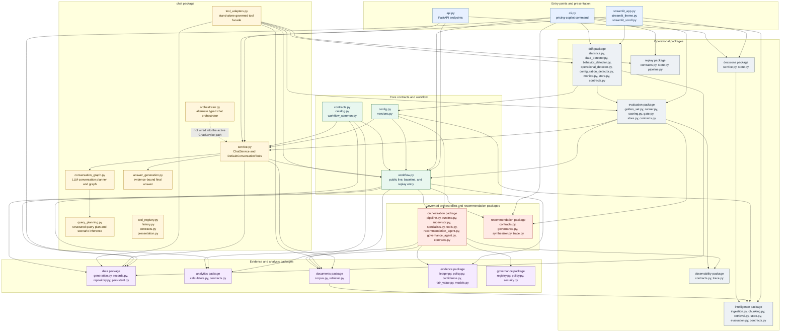
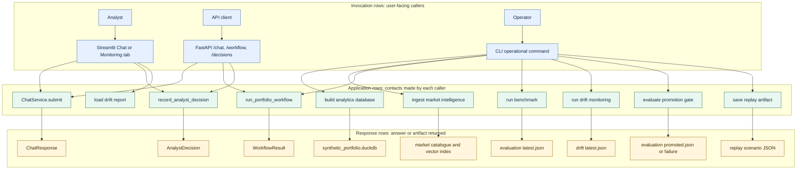
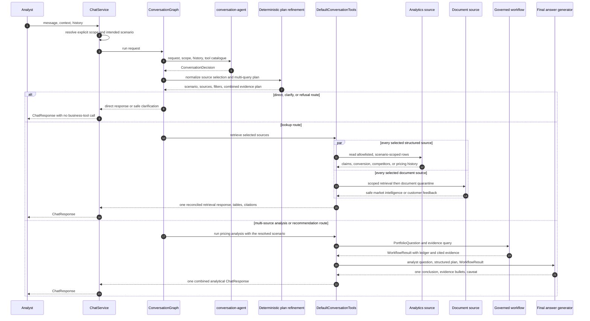
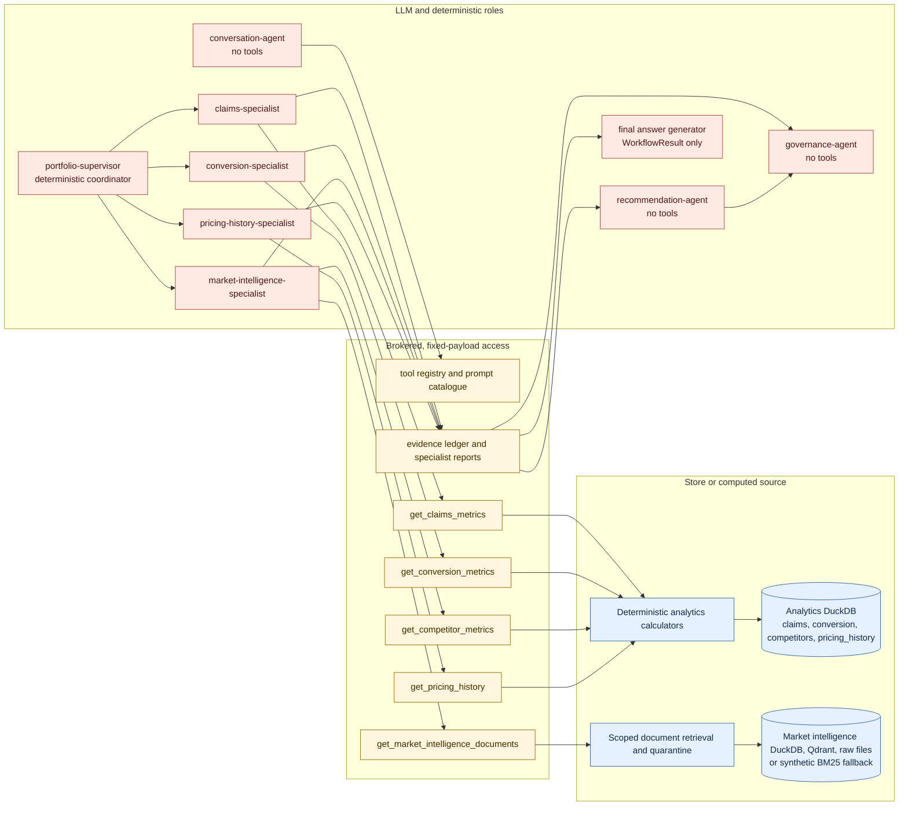
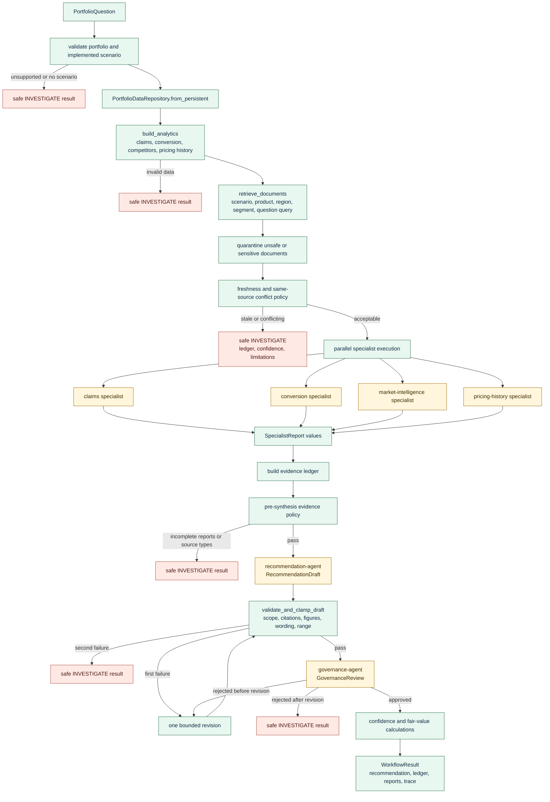
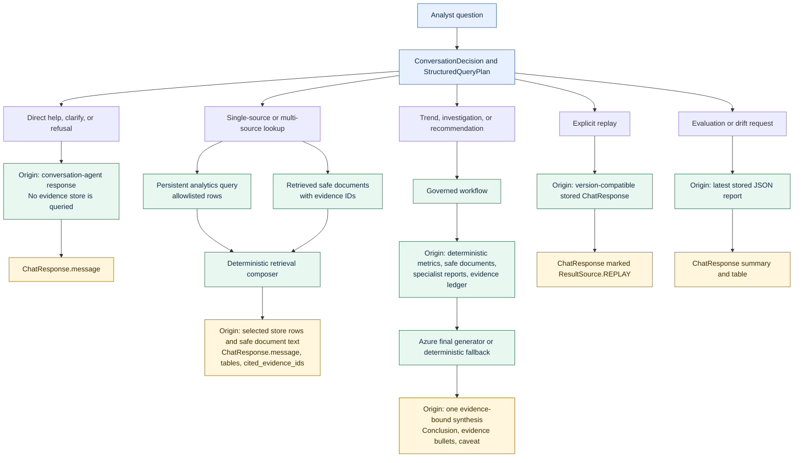
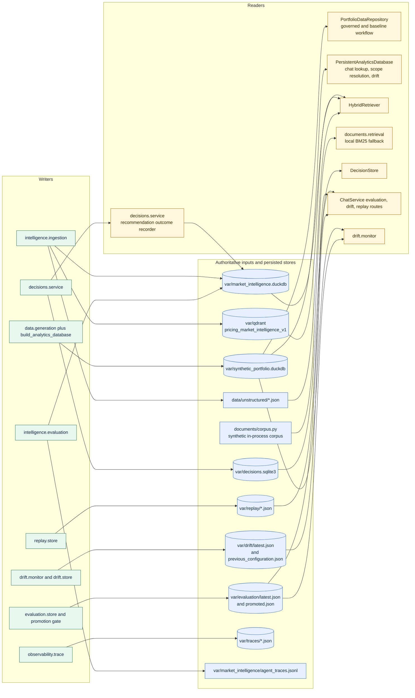
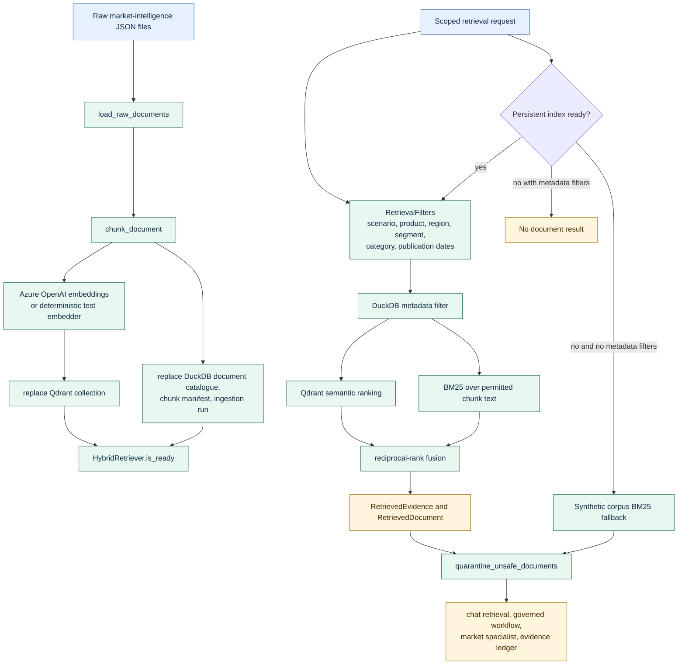
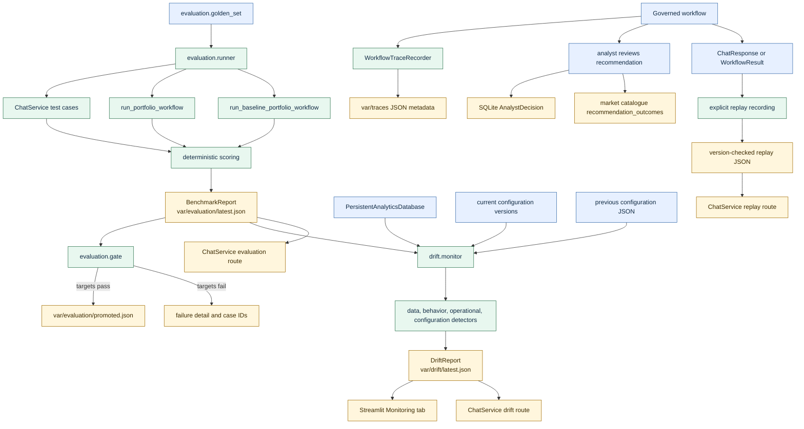

```mermaid
flowchart TB
    subgraph Entry["Entry points and presentation"]
        UI["streamlit_app.py<br/>streamlit_theme.py<br/>streamlit_scroll.py"]
        API["api.py<br/>FastAPI endpoints"]
        CLI["cli.py<br/>pricing-copilot command"]
    end

    subgraph Core["Core contracts and workflow"]
        CFG["config.py<br/>versions.py"]
        CONTRACTS["contracts.py<br/>catalog.py<br/>workflow_common.py"]
        WF["workflow.py<br/>public live, baseline, and replay entry"]
    end

    subgraph Chat["chat package"]
        CHAT["service.py<br/>ChatService and DefaultConversationTools"]
        GRAPH["conversation_graph.py<br/>LLM conversation planner and graph"]
        PLAN["query_planning.py<br/>structured query plan and scenario inference"]
        FINAL["answer_generation.py<br/>evidence-bound final answer"]
        CHATDATA["tool_registry.py<br/>history.py<br/>contracts.py<br/>presentation.py"]
        FACADE["tool_adapters.py<br/>stand-alone governed tool facade"]
        ALT["orchestrator.py<br/>alternate typed chat orchestrator"]
    end

    subgraph Analysis["Evidence and analysis packages"]
        DATA["data package<br/>generation.py, records.py, repository.py, persistent.py"]
        METRICS["analytics package<br/>calculators.py, contracts.py"]
        DOCS["documents package<br/>corpus.py, retrieval.py"]
        LEDGER["evidence package<br/>ledger.py, policy.py, confidence.py, fair_value.py, models.py"]
        GOV["governance package<br/>registry.py, policy.py, security.py"]
    end

    subgraph Agents["Governed orchestration and recommendation packages"]
        PIPE["orchestration package<br/>pipeline.py, runtime.py, supervisor.py, specialists.py, tools.py,<br/>recommendation_agent.py, governance_agent.py, contracts.py"]
        REC["recommendation package<br/>contracts.py, governance.py, synthesizer.py, trace.py"]
    end

    subgraph Operations["Operational packages"]
        INTEL["intelligence package<br/>ingestion.py, chunking.py, retrieval.py, store.py, evaluation.py, contracts.py"]
        DEC["decisions package<br/>service.py, store.py"]
        REP["replay package<br/>contracts.py, store.py, pipeline.py"]
        OBS["observability package<br/>contracts.py, trace.py"]
        EVAL["evaluation package<br/>golden_set.py, runner.py, scoring.py, gate.py, store.py, contracts.py"]
        DRIFT["drift package<br/>statistics.py, data_detector.py, behavior_detector.py,<br/>operational_detector.py, configuration_detector.py, monitor.py, store.py, contracts.py"]
    end

    UI --> CHAT
    UI --> DEC
    UI --> DRIFT
    API --> CHAT
    API --> WF
    API --> DEC
    CLI --> DATA
    CLI --> INTEL
    CLI --> WF
    CLI --> EVAL
    CLI --> DRIFT
    CLI --> REP
    CLI --> REC
    CFG --> CHAT
    CFG --> WF
    CFG --> PIPE
    CFG --> INTEL
    CONTRACTS --> CHAT
    CONTRACTS --> WF
    CONTRACTS --> DATA
    CONTRACTS --> METRICS
    CHAT --> GRAPH
    GRAPH --> PLAN
    CHAT --> FINAL
    CHAT --> DATA
    CHAT --> DOCS
    CHAT --> WF
    FACADE --> DATA
    FACADE --> DOCS
    FACADE --> WF
    FACADE --> REP
    FACADE --> EVAL
    FACADE --> DRIFT
    ALT -.->|not wired into the active ChatService path| CHAT
    WF --> DATA
    WF --> METRICS
    WF --> DOCS
    WF --> LEDGER
    WF --> PIPE
    WF --> REC
    PIPE --> GOV
    PIPE --> METRICS
    PIPE --> DOCS
    PIPE --> LEDGER
    PIPE --> OBS
    DOCS --> INTEL
    DEC --> INTEL
    EVAL --> CHAT
    EVAL --> WF
    EVAL --> REC
    EVAL --> OBS
    DRIFT --> DATA
    DRIFT --> EVAL
    DRIFT --> CFG

    classDef entry fill:#e7f0ff,stroke:#3267a8,color:#102a43
    classDef core fill:#e8f7ef,stroke:#28704a,color:#102a43
    classDef chat fill:#fff6dd,stroke:#a06b00,color:#3d2b00
    classDef analysis fill:#f5eaff,stroke:#7651a6,color:#2f1646
    classDef agents fill:#ffe9e5,stroke:#a84738,color:#4b1711
    classDef operations fill:#edf1f5,stroke:#546270,color:#1c2833
    class UI,API,CLI entry
    class CFG,CONTRACTS,WF core
    class CHAT,GRAPH,PLAN,FINAL,CHATDATA,FACADE,ALT chat
    class DATA,METRICS,DOCS,LEDGER,GOV analysis
    class PIPE,REC agents
    class INTEL,DEC,REP,OBS,EVAL,DRIFT operations
```

```mermaid
flowchart TB
    subgraph R1["Invocation rows: user-facing callers"]
        Analyst["Analyst"] --> Streamlit["Streamlit Chat or Monitoring tab"]
        Client["API client"] --> FastAPI["FastAPI /chat, /workflow, /decisions"]
        Operator["Operator"] --> Command["CLI operational command"]
    end

    subgraph R2["Application rows: contacts made by each caller"]
        Streamlit --> CS["ChatService.submit"]
        Streamlit --> DS["record_analyst_decision"]
        Streamlit --> LoadDrift["load drift report"]
        FastAPI --> CS
        FastAPI --> PublicWF["run_portfolio_workflow"]
        FastAPI --> DS
        Command --> BuildData["build analytics database"]
        Command --> Ingest["ingest market intelligence"]
        Command --> PublicWF
        Command --> Benchmark["run benchmark"]
        Command --> Monitor["run drift monitoring"]
        Command --> Promotion["evaluate promotion gate"]
        Command --> ReplaySave["save replay artifact"]
    end

    subgraph R3["Response rows: answer or artifact returned"]
        CS --> ChatResponse["ChatResponse"]
        PublicWF --> WorkflowResult["WorkflowResult"]
        DS --> AnalystDecision["AnalystDecision"]
        BuildData --> AnalyticsArtifact["synthetic_portfolio.duckdb"]
        Ingest --> IntelligenceArtifact["market catalogue and vector index"]
        Benchmark --> BenchmarkArtifact["evaluation latest.json"]
        Monitor --> DriftArtifact["drift latest.json"]
        Promotion --> PromotedArtifact["evaluation promoted.json or failure"]
        ReplaySave --> ReplayArtifact["replay scenario JSON"]
    end

    classDef caller fill:#e7f0ff,stroke:#3267a8,color:#102a43
    classDef app fill:#e8f7ef,stroke:#28704a,color:#102a43
    classDef output fill:#fff6dd,stroke:#a06b00,color:#3d2b00
    class Analyst,Client,Operator,Streamlit,FastAPI,Command caller
    class CS,DS,LoadDrift,PublicWF,BuildData,Ingest,Benchmark,Monitor,Promotion,ReplaySave app
    class ChatResponse,WorkflowResult,AnalystDecision,AnalyticsArtifact,IntelligenceArtifact,BenchmarkArtifact,DriftArtifact,PromotedArtifact,ReplayArtifact output
```

```mermaid
sequenceDiagram
    autonumber
    participant U as Analyst
    participant S as ChatService
    participant G as ConversationGraph
    participant P as conversation-agent
    participant Q as Deterministic plan refinement
    participant T as DefaultConversationTools
    participant A as Analytics source
    participant D as Document source
    participant W as Governed workflow
    participant F as Final answer generator

    U->>S: message, context, history
    S->>S: resolve explicit scope and intended scenario
    S->>G: run request
    G->>P: request, scope, history, tool catalogue
    P-->>G: ConversationDecision
    G->>Q: normalize source selection and multi-query plan
    Q-->>G: scenario, sources, filters, combined evidence plan

    alt direct, clarify, or refusal route
        G-->>S: direct response or safe clarification
        S-->>U: ChatResponse with no business-tool call
    else lookup route
        G->>T: retrieve selected sources
        par every selected structured source
            T->>A: read allowlisted, scenario-scoped rows
            A-->>T: claims, conversion, competitors, or pricing history
        and every selected document source
            T->>D: scoped retrieval then document quarantine
            D-->>T: safe market intelligence or customer feedback
        end
        T-->>S: one reconciled retrieval response, tables, citations
        S-->>U: ChatResponse
    else multi-source analysis or recommendation route
        G->>T: run pricing analysis with the resolved scenario
        T->>W: PortfolioQuestion and evidence query
        W-->>T: WorkflowResult with ledger and cited evidence
        T->>F: analyst question, structured plan, WorkflowResult
        F-->>T: one conclusion, evidence bullets, caveat
        T-->>S: one combined analytical ChatResponse
        S-->>U: ChatResponse
    end
```

```mermaid
flowchart LR
    subgraph Roles["LLM and deterministic roles"]
        CP["conversation-agent<br/>no tools"]
        PS["portfolio-supervisor<br/>deterministic coordinator"]
        CL["claims-specialist"]
        CV["conversion-specialist"]
        MI["market-intelligence-specialist"]
        PH["pricing-history-specialist"]
        RA["recommendation-agent<br/>no tools"]
        GA["governance-agent<br/>no tools"]
        FA["final answer generator<br/>WorkflowResult only"]
    end

    subgraph Brokers["Brokered, fixed-payload access"]
        Catalogue["tool registry and prompt catalogue"]
        ClaimsTool["get_claims_metrics"]
        ConversionTool["get_conversion_metrics"]
        CompetitorTool["get_competitor_metrics"]
        HistoryTool["get_pricing_history"]
        DocumentTool["get_market_intelligence_documents"]
        Ledger["evidence ledger and specialist reports"]
    end

    subgraph Stores["Store or computed source"]
        AnalyticsDB[("Analytics DuckDB<br/>claims, conversion, competitors, pricing_history")]
        MetricCalc["Deterministic analytics calculators"]
        Retrieval["Scoped document retrieval and quarantine"]
        Intelligence[("Market intelligence DuckDB, Qdrant, raw files<br/>or synthetic BM25 fallback")]
    end

    CP --> Catalogue
    PS --> CL
    PS --> CV
    PS --> MI
    PS --> PH
    CL --> ClaimsTool
    CV --> ConversionTool
    MI --> CompetitorTool
    MI --> DocumentTool
    PH --> HistoryTool
    ClaimsTool --> MetricCalc
    ConversionTool --> MetricCalc
    CompetitorTool --> MetricCalc
    HistoryTool --> MetricCalc
    MetricCalc --> AnalyticsDB
    DocumentTool --> Retrieval
    Retrieval --> Intelligence
    CL --> Ledger
    CV --> Ledger
    MI --> Ledger
    PH --> Ledger
    Ledger --> RA
    Ledger --> GA
    Ledger --> FA
    RA --> GA

    classDef agent fill:#ffe9e5,stroke:#a84738,color:#4b1711
    classDef broker fill:#fff6dd,stroke:#a06b00,color:#3d2b00
    classDef store fill:#e7f0ff,stroke:#3267a8,color:#102a43
    class CP,PS,CL,CV,MI,PH,RA,GA,FA agent
    class Catalogue,ClaimsTool,ConversionTool,CompetitorTool,HistoryTool,DocumentTool,Ledger broker
    class AnalyticsDB,MetricCalc,Retrieval,Intelligence store
```

```mermaid
flowchart TB
    Start["PortfolioQuestion"] --> Scope["validate portfolio and implemented scenario"]
    Scope -->|unsupported or no scenario| SafeScope["safe INVESTIGATE result"]
    Scope --> Repo["PortfolioDataRepository.from_persistent"]
    Repo --> Calc["build_analytics<br/>claims, conversion, competitors, pricing history"]
    Calc -->|invalid data| SafeData["safe INVESTIGATE result"]
    Calc --> Retrieve["retrieve_documents<br/>scenario, product, region, segment, question query"]
    Retrieve --> Quarantine["quarantine unsafe or sensitive documents"]
    Quarantine --> EvidencePolicy["freshness and same-source conflict policy"]
    EvidencePolicy -->|stale or conflicting| SafeEvidence["safe INVESTIGATE<br/>ledger, confidence, limitations"]

    EvidencePolicy -->|acceptable| Parallel["parallel specialist execution"]
    Parallel --> Claims["claims specialist"]
    Parallel --> Conversion["conversion specialist"]
    Parallel --> Market["market-intelligence specialist"]
    Parallel --> History["pricing-history specialist"]
    Claims --> Reports["SpecialistReport values"]
    Conversion --> Reports
    Market --> Reports
    History --> Reports
    Reports --> Ledger["build evidence ledger"]
    Ledger --> PrePolicy["pre-synthesis evidence policy"]
    PrePolicy -->|incomplete reports or source types| SafePre["safe INVESTIGATE result"]
    PrePolicy -->|pass| Draft["recommendation-agent<br/>RecommendationDraft"]
    Draft --> Deterministic["validate_and_clamp_draft<br/>scope, citations, figures, wording, range"]
    Deterministic -->|first failure| Revise["one bounded revision"]
    Revise --> Deterministic
    Deterministic -->|second failure| SafeDraft["safe INVESTIGATE result"]
    Deterministic -->|pass| Challenge["governance-agent<br/>GovernanceReview"]
    Challenge -->|rejected before revision| Revise
    Challenge -->|rejected after revision| SafeReview["safe INVESTIGATE result"]
    Challenge -->|approved| Measures["confidence and fair-value calculations"]
    Measures --> Result["WorkflowResult<br/>recommendation, ledger, reports, trace"]

    classDef stop fill:#ffe9e5,stroke:#a84738,color:#4b1711
    classDef process fill:#e8f7ef,stroke:#28704a,color:#102a43
    classDef agent fill:#fff6dd,stroke:#a06b00,color:#3d2b00
    class SafeScope,SafeData,SafeEvidence,SafePre,SafeDraft,SafeReview stop
    class Start,Scope,Repo,Calc,Retrieve,Quarantine,EvidencePolicy,Parallel,Reports,Ledger,PrePolicy,Deterministic,Revise,Measures,Result process
    class Claims,Conversion,Market,History,Draft,Challenge agent
```

```mermaid
flowchart TB
    Question["Analyst question"] --> Decision["ConversationDecision and StructuredQueryPlan"]
    Decision --> Direct["Direct help, clarify, or refusal"]
    Direct --> DirectOrigin["Origin: conversation-agent response<br/>No evidence store is queried"]
    DirectOrigin --> DirectAnswer["ChatResponse.message"]

    Decision --> Lookup["Single-source or multi-source lookup"]
    Lookup --> Structured["Persistent analytics query<br/>allowlisted rows"]
    Lookup --> Documents["Retrieved safe documents<br/>with evidence IDs"]
    Structured --> RetrievalCompose["Deterministic retrieval composer"]
    Documents --> RetrievalCompose
    RetrievalCompose --> LookupAnswer["Origin: selected store rows and safe document text<br/>ChatResponse.message, tables, cited_evidence_ids"]

    Decision --> Analysis["Trend, investigation, or recommendation"]
    Analysis --> Workflow["Governed workflow"]
    Workflow --> AnalyticOrigin["Origin: deterministic metrics, safe documents,<br/>specialist reports, evidence ledger"]
    AnalyticOrigin --> FinalGenerator["Azure final generator or deterministic fallback"]
    FinalGenerator --> AnalysisAnswer["Origin: one evidence-bound synthesis<br/>Conclusion, evidence bullets, caveat"]

    Decision --> Replay["Explicit replay"]
    Replay --> ReplayOrigin["Origin: version-compatible stored ChatResponse"]
    ReplayOrigin --> ReplayAnswer["ChatResponse marked ResultSource.REPLAY"]

    Decision --> Reports["Evaluation or drift request"]
    Reports --> ReportOrigin["Origin: latest stored JSON report"]
    ReportOrigin --> ReportAnswer["ChatResponse summary and table"]

    classDef request fill:#e7f0ff,stroke:#3267a8,color:#102a43
    classDef source fill:#e8f7ef,stroke:#28704a,color:#102a43
    classDef answer fill:#fff6dd,stroke:#a06b00,color:#3d2b00
    class Question,Decision request
    class DirectOrigin,Structured,Documents,AnalyticOrigin,ReplayOrigin,ReportOrigin,Workflow,FinalGenerator,RetrievalCompose source
    class DirectAnswer,LookupAnswer,AnalysisAnswer,ReplayAnswer,ReportAnswer answer
```

```mermaid
flowchart LR
    subgraph Sources["Authoritative inputs and persisted stores"]
        Raw["data/unstructured/*.json"]
        Corpus["documents/corpus.py<br/>synthetic in-process corpus"]
        Analytics[("var/synthetic_portfolio.duckdb")]
        Market[("var/market_intelligence.duckdb")]
        Vectors[("var/qdrant<br/>pricing_market_intelligence_v1")]
        Decisions[("var/decisions.sqlite3")]
        Replay[("var/replay/*.json")]
        Evaluation[("var/evaluation/latest.json<br/>and promoted.json")]
        Drift[("var/drift/latest.json<br/>and previous_configuration.json")]
        Traces[("var/traces/*.json")]
        AgentTrace["var/market_intelligence/agent_traces.jsonl"]
    end

    subgraph Writers["Writers"]
        Synthetic["data.generation plus build_analytics_database"]
        Ingestion["intelligence.ingestion"]
        DecisionService["decisions.service"]
        ReplayStore["replay.store"]
        EvaluationStore["evaluation.store and promotion gate"]
        DriftStore["drift.monitor and drift.store"]
        TraceRecorder["observability.trace"]
        RetrievalEval["intelligence.evaluation"]
    end

    subgraph Readers["Readers"]
        PortfolioRepo["PortfolioDataRepository<br/>governed and baseline workflow"]
        ChatDB["PersistentAnalyticsDatabase<br/>chat lookup, scope resolution, drift"]
        Hybrid["HybridRetriever"]
        Fallback["documents.retrieval<br/>local BM25 fallback"]
        DecisionStore["DecisionStore"]
        ChatReports["ChatService evaluation, drift, replay routes"]
        Monitoring["drift.monitor"]
        GovernanceOutcome["decisions.service<br/>recommendation outcome recorder"]
    end

    Synthetic --> Analytics
    Ingestion --> Raw
    Ingestion --> Market
    Ingestion --> Vectors
    DecisionService --> Decisions
    DecisionService --> GovernanceOutcome
    GovernanceOutcome --> Market
    ReplayStore --> Replay
    EvaluationStore --> Evaluation
    DriftStore --> Drift
    TraceRecorder --> Traces
    RetrievalEval --> Market
    RetrievalEval --> AgentTrace

    Analytics --> PortfolioRepo
    Analytics --> ChatDB
    Analytics --> Monitoring
    Market --> Hybrid
    Vectors --> Hybrid
    Raw --> Hybrid
    Corpus --> Fallback
    Decisions --> DecisionStore
    Replay --> ChatReports
    Evaluation --> ChatReports
    Evaluation --> Monitoring
    Drift --> ChatReports

    classDef db fill:#e7f0ff,stroke:#3267a8,color:#102a43
    classDef writer fill:#e8f7ef,stroke:#28704a,color:#102a43
    classDef reader fill:#fff6dd,stroke:#a06b00,color:#3d2b00
    class Raw,Corpus,Analytics,Market,Vectors,Decisions,Replay,Evaluation,Drift,Traces,AgentTrace db
    class Synthetic,Ingestion,DecisionService,ReplayStore,EvaluationStore,DriftStore,TraceRecorder,RetrievalEval writer
    class PortfolioRepo,ChatDB,Hybrid,Fallback,DecisionStore,ChatReports,Monitoring,GovernanceOutcome reader
```

```mermaid
flowchart TB
    RawFiles["Raw market-intelligence JSON files"] --> Load["load_raw_documents"]
    Load --> Chunk["chunk_document"]
    Chunk --> Embed["Azure OpenAI embeddings<br/>or deterministic test embedder"]
    Embed --> Index["replace Qdrant collection"]
    Chunk --> Catalogue["replace DuckDB document catalogue,<br/>chunk manifest, ingestion run"]
    Index --> Ready["HybridRetriever.is_ready"]
    Catalogue --> Ready

    Query["Scoped retrieval request"] --> Filters["RetrievalFilters<br/>scenario, product, region, segment,<br/>category, publication dates"]
    Filters --> Metadata["DuckDB metadata filter"]
    Metadata --> Vector["Qdrant semantic ranking"]
    Metadata --> Keyword["BM25 over permitted chunk text"]
    Vector --> Fusion["reciprocal-rank fusion"]
    Keyword --> Fusion
    Fusion --> Evidence["RetrievedEvidence and RetrievedDocument"]
    Evidence --> Security["quarantine_unsafe_documents"]
    Security --> Consumers["chat retrieval, governed workflow,<br/>market specialist, evidence ledger"]

    Query --> Unavailable{"Persistent index ready?"}
    Unavailable -->|yes| Filters
    Unavailable -->|no and no metadata filters| Legacy["Synthetic corpus BM25 fallback"]
    Legacy --> Security
    Unavailable -->|no with metadata filters| Empty["No document result"]

    classDef input fill:#e7f0ff,stroke:#3267a8,color:#102a43
    classDef process fill:#e8f7ef,stroke:#28704a,color:#102a43
    classDef result fill:#fff6dd,stroke:#a06b00,color:#3d2b00
    class RawFiles,Query input
    class Load,Chunk,Embed,Index,Catalogue,Ready,Filters,Metadata,Vector,Keyword,Fusion,Security,Legacy process
    class Evidence,Consumers,Empty result
```

```mermaid
flowchart TB
    Golden["evaluation.golden_set"] --> Runner["evaluation.runner"]
    Runner --> ChatPath["ChatService test cases"]
    Runner --> GovernedPath["run_portfolio_workflow"]
    Runner --> BaselinePath["run_baseline_portfolio_workflow"]
    ChatPath --> Score["deterministic scoring"]
    GovernedPath --> Score
    BaselinePath --> Score
    Score --> Bench["BenchmarkReport<br/>var/evaluation/latest.json"]
    Bench --> Gate["evaluation.gate"]
    Gate -->|targets pass| Promoted["var/evaluation/promoted.json"]
    Gate -->|targets fail| NotPromoted["failure detail and case IDs"]

    Bench --> Drift["drift.monitor"]
    Analytics["PersistentAnalyticsDatabase"] --> Drift
    Versions["current configuration versions"] --> Drift
    Previous["previous configuration JSON"] --> Drift
    Drift --> Detectors["data, behavior, operational, configuration detectors"]
    Detectors --> DriftReport["DriftReport<br/>var/drift/latest.json"]
    DriftReport --> MonitoringUI["Streamlit Monitoring tab"]
    DriftReport --> ChatDrift["ChatService drift route"]
    Bench --> ChatEvaluation["ChatService evaluation route"]

    Workflow["Governed workflow"] --> Trace["WorkflowTraceRecorder"]
    Trace --> TraceFiles["var/traces JSON metadata"]
    Workflow --> DecisionRequest["analyst reviews recommendation"]
    DecisionRequest --> Decisions["SQLite AnalystDecision"]
    DecisionRequest --> Outcome["market catalogue recommendation_outcomes"]
    Workflow --> Response["ChatResponse or WorkflowResult"]
    Response --> ReplaySave["explicit replay recording"]
    ReplaySave --> Replay["version-checked replay JSON"]
    Replay --> ChatReplay["ChatService replay route"]

    classDef source fill:#e7f0ff,stroke:#3267a8,color:#102a43
    classDef process fill:#e8f7ef,stroke:#28704a,color:#102a43
    classDef artifact fill:#fff6dd,stroke:#a06b00,color:#3d2b00
    class Golden,Analytics,Versions,Previous,Workflow,DecisionRequest,Response source
    class Runner,ChatPath,GovernedPath,BaselinePath,Score,Gate,Drift,Detectors,Trace,ReplaySave process
    class Bench,Promoted,NotPromoted,DriftReport,MonitoringUI,ChatDrift,ChatEvaluation,TraceFiles,Decisions,Outcome,Replay,ChatReplay artifact
```

```mermaid
flowchart LR
    Request["Request and scope"] --> RequestGuard["Pydantic contracts, supported portfolio,<br/>aggregate-only and prohibited-attribute checks"]
    RequestGuard --> PlannerGuard["approved conversation plan and source allowlist"]
    PlannerGuard --> DataGuard["read-only DuckDB source and column allowlists"]
    PlannerGuard --> DocGuard["metadata filters and document quarantine"]
    DataGuard --> EvidenceGuard["deterministic metrics, evidence ledger,<br/>freshness and conflict checks"]
    DocGuard --> EvidenceGuard
    EvidenceGuard --> AgentGuard["agent registry, typed output, no handoffs,<br/>turn, tool-call, timeout, and retry limits"]
    AgentGuard --> DraftGuard["citation, scope, numeric, causal-language,<br/>execution-language, and price-range validation"]
    DraftGuard --> Challenge["independent governance-agent review"]
    Challenge --> Human["qualified analyst decision"]
    Human --> Record["separate decision log and outcome record"]

    RequestGuard -.->|block or clarify| Investigate["safe refusal or INVESTIGATE"]
    DocGuard -.->|unsafe or missing evidence| Investigate
    EvidenceGuard -.->|stale, conflicting, or incomplete evidence| Investigate
    AgentGuard -.->|runtime or model failure| Investigate
    DraftGuard -.->|second validation failure| Investigate
    Challenge -.->|rejected after bounded revision| Investigate

    classDef guard fill:#ffe9e5,stroke:#a84738,color:#4b1711
    classDef output fill:#fff6dd,stroke:#a06b00,color:#3d2b00
    class Request,Human,Record output
    class RequestGuard,PlannerGuard,DataGuard,DocGuard,EvidenceGuard,AgentGuard,DraftGuard,Challenge,Investigate guard
```
