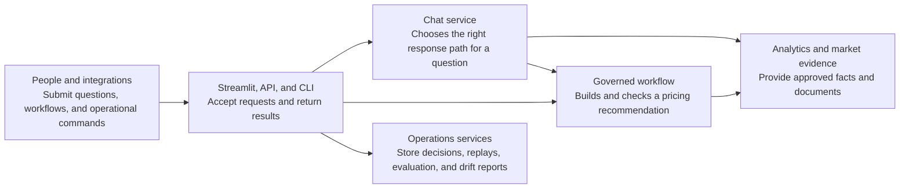
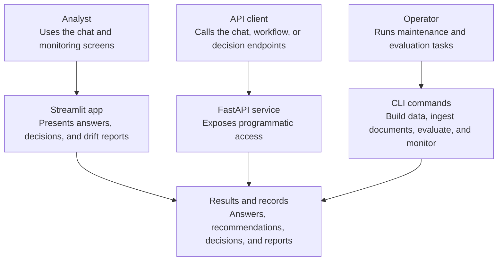
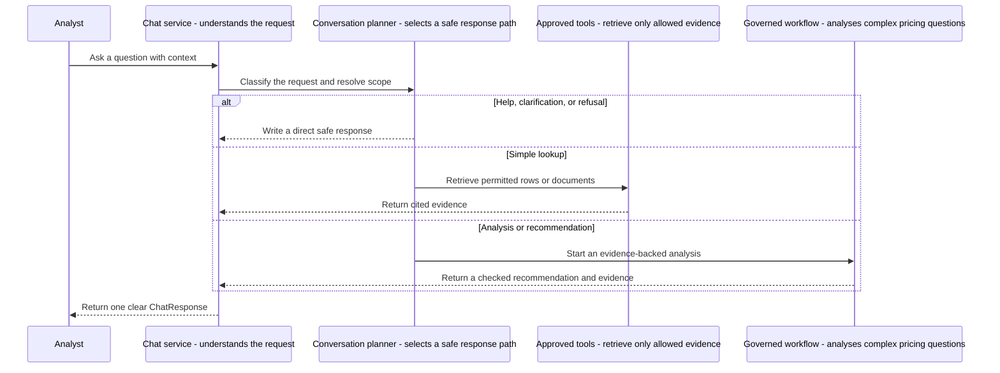
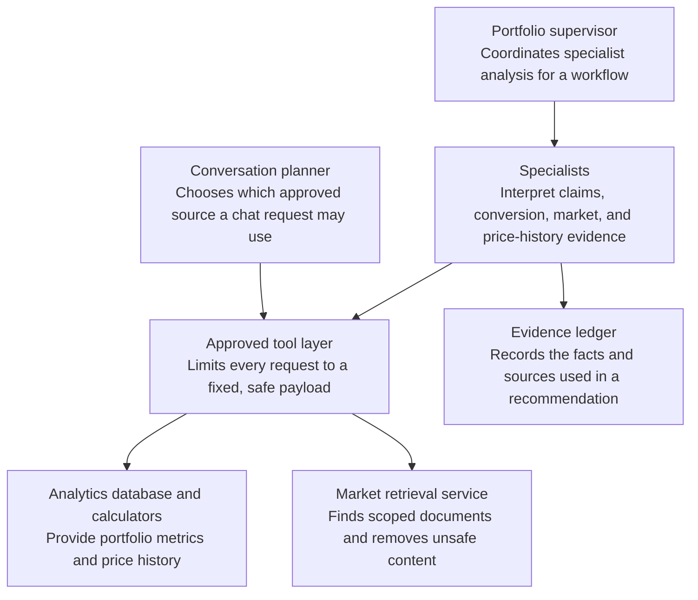
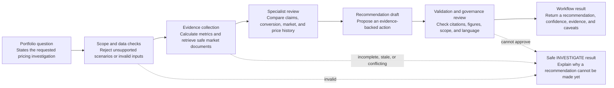
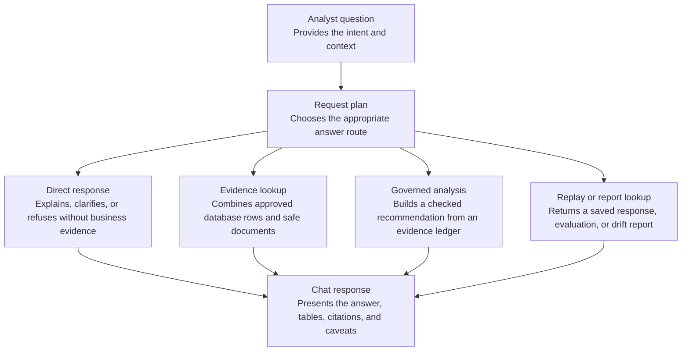
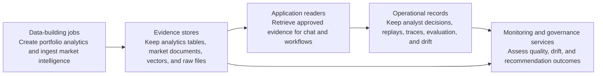
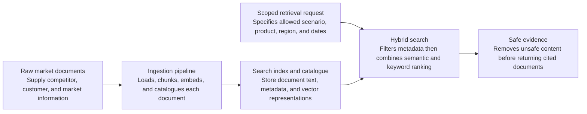
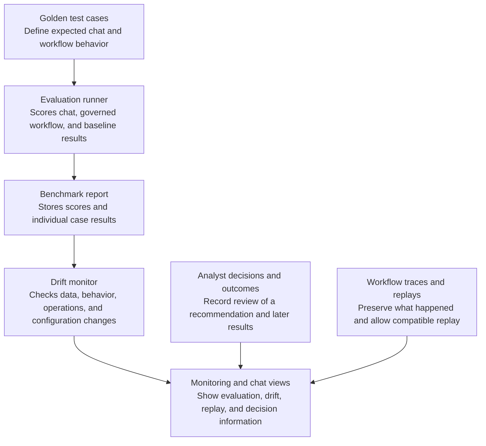
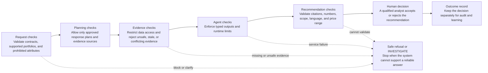

# Complete system documentation

## 1. System at a glance

> How to read this diagram: People use the Streamlit app, API, or CLI.
> The chat service answers questions directly or starts the governed workflow.
> Both use approved evidence, while operations services keep the records needed to monitor and improve the system.

## 2. Ways to use the system

> How to read this diagram: The system has three entry points.
> Streamlit is for analyst work, the API is for other software, and the CLI is for operational jobs.
> Each produces a useful answer, report, or stored record.

## 3. Chat request journey

> How to read this diagram: Every chat message is planned before evidence is read.
> Simple requests use approved lookups.
> Pricing analysis goes through the governed workflow, which returns a checked, evidence-backed result.

## 4. Who can access evidence

> How to read this diagram: Models and specialists do not read databases directly.
> They use the approved tool layer, which restricts what can be retrieved.
> Specialist findings are preserved in the evidence ledger for later checking.

## 5. Governed pricing workflow

> How to read this diagram: A recommendation is only produced after scope, data, evidence, and governance checks pass.
> Any failed safety check produces an INVESTIGATE result instead of an unsupported recommendation.

## 6. How an answer is produced

> How to read this diagram: The request plan keeps response types distinct.
> Direct chat does not query evidence, lookups cite retrieved evidence, analysis uses the governed workflow, and replay or reporting routes read saved artifacts.

## 7. Data and persisted records

> How to read this diagram: Data-building jobs create the evidence stores used by the application.
> Separate operational records make decisions and system behavior auditable, while monitoring compares those records with the underlying data.

## 8. Market-intelligence ingestion and retrieval

> How to read this diagram: Documents are prepared once during ingestion.
> At question time, retrieval first applies scope filters, then combines semantic and keyword search.
> Unsafe content is quarantined before any document becomes evidence.

## 9. Evaluation, drift, and replay

> How to read this diagram: Golden cases measure quality.
> Their results feed drift monitoring, while decisions, traces, and replays provide additional operational context.
> Analysts can view all of these through the monitoring and chat routes.

## 10. Safety controls

> How to read this diagram: Controls are applied in layers, from the incoming request through the final analyst decision.
> A problem at any automated layer stops the path and returns a safe refusal or INVESTIGATE outcome.
