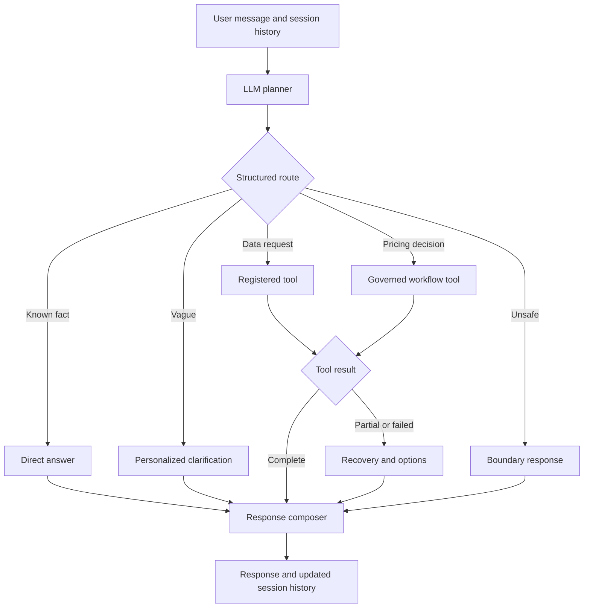

# Conversation Graph Prototype Plan

## Outcome and time box

Replace the rule-based chat router with an LLM-first graph that answers stable facts directly, asks personalized clarification, selects registered business tools, and explains partial or unavailable results honestly.

Keep conversation history only in the active Streamlit session and clear it on page refresh.

Target: 3 hours and 45 minutes.

## Parallel ownership

This agent owns:

- `src/pricing_copilot/chat/contracts.py`
- `src/pricing_copilot/chat/service.py`
- New `src/pricing_copilot/chat/conversation_graph.py`
- New `src/pricing_copilot/chat/prompts.py`
- `src/pricing_copilot/streamlit_app.py`
- `tests/test_chat_service.py`
- `tests/test_streamlit_chat_e2e.py`
- `tests/test_streamlit_copy.py`
- New `tests/test_conversation_graph.py`
- `pyproject.toml` if LangGraph is added.

The database and tool agent owns:

- New `src/pricing_copilot/chat/tool_adapters.py`
- Any new SQL validator or query executor.
- `src/pricing_copilot/data/persistent.py`
- `src/pricing_copilot/data/repository.py`
- `src/pricing_copilot/orchestration/pipeline.py`
- `src/pricing_copilot/workflow.py`
- New `tests/test_chat_tool_adapters.py`
- New `tests/test_chat_tool_adapters_e2e.py`
- `tests/test_persistent_data.py`
- `tests/test_data_repository.py`
- `tests/test_orchestration_pipeline.py`

Neither agent edits files owned by the other.

Contract changes needed by the tool agent are requested from this agent.

## Required tool hand-off

The tool agent provides an injectable registry.

Each tool exposes a stable name, LLM-readable description, typed input, permitted sources, and a typed result.

The result contains display text, optional tables, evidence identifiers, limitations, and a failure category.

Failure categories distinguish unavailable data, invalid input, denied access, and execution failure.

The graph never imports a database connection or executes SQL directly.

## Target flow

## Tasks

### 1. Lock the E2E baseline

Estimate: 20 minutes.

- Reproduce factual, ambiguous, data, recommendation, SQL, unsafe, tool-failure, follow-up, and refresh scenarios through the UI.
- Mark keyword-routing tests that will be replaced.
- Confirm that a random factual question currently receives generic source clarification.

Acceptance: the baseline tests express the required user-visible behavior and the refresh test verifies a new empty session.

### 2. Replace routing contracts with graph contracts

Estimate: 30 minutes.

- Add routes for `direct_answer`, `clarify`, `tool_call`, `pricing_workflow`, and `refuse`.
- Add conversation messages and graph state for input, session history, route, tool calls, results, errors, and response.
- Add response fields for limitations, suggested next steps, and clarification.
- Preserve tables, evidence identifiers, activities, workflow results, and replay labels.

Acceptance: malformed routes and tool calls fail validation, while governed workflow results still serialize and render.

### 3. Build the LLM-first graph

Estimate: 75 minutes.

- Implement planner, direct-answer, clarification, tool-call, recovery, refusal, and composition nodes.
- Use structured model output and pass current-session history to the planner.
- Answer stable facts without a business tool.
- Invoke only tools advertised by the injected registry.
- Route pricing decisions to the existing governed workflow tool.
- Ask one contextual question when missing information changes the answer.
- Offer two or three likely interpretations or next steps when useful.
- Preserve useful partial results and disclose tool limitations.
- Retry invalid structured output once, then return a recoverable explanation.
- Keep authorization, privacy, protected-attribute, and SQL enforcement deterministic at tool boundaries.

Acceptance:

- “What is the capital of France?” answers “Paris” without tool activity.
- “What was our price last month?” clarifies approved action versus observed premium.
- “I mean the approved action” uses history and selects pricing history.
- “Should we increase the price next month?” selects the governed workflow.
- Unknown tool names are rejected without execution.

### 4. Reduce `ChatService` to an adapter

Estimate: 25 minutes.

- Keep `ChatService.submit` as the application entry point.
- Inject the graph, model, and tool registry for deterministic tests.
- Pass session history and activity callbacks into the graph.
- Return the typed graph response.

Delete `_SOURCE_KEYWORDS`, routing use of `_SOURCE_LABELS`, `_SQL_PATTERN`, `_scenario_for`, `_intent_for`, `_sources_for`, `_requested_fields`, `_retrieve_sources`, fixed help routing, generic source clarification, and hard-coded pricing-question construction.

Acceptance: `ChatService` has no keyword intent routing, safe SQL can reach its tool, and destructive SQL is blocked inside that tool.

### 5. Make Streamlit memory session-only

Estimate: 30 minutes.

- Store plain messages and typed assistant responses in `st.session_state`.
- Pass all current-session messages to each submission.
- Create one graph-backed service per active session.
- Never cache or persist conversation history.
- Initialize only the welcome message for a new WebSocket session.
- Update welcome copy and suggestions to demonstrate facts, clarification, data, and recommendations.

Acceptance: follow-ups use context, independent sessions share nothing, hard refresh clears prior messages, and no conversation is written to disk.

### 6. Replace tests and verify

Estimate: 45 minutes.

- Use a deterministic fake planner and fake registry.
- Test facts, clarification, follow-ups, tool selection, pricing workflow selection, partial results, invalid output, unknown tools, and refusals.
- Keep security assertions at the tool boundary.
- Run formatting, linting, type checking, focused chat tests, Streamlit E2E tests, and the full suite.

Acceptance: tests need no live credentials, the UI exposes no hidden reasoning, and data-backed responses include evidence or an explicit limitation.

## Integration order

1. The tool agent publishes the `ChatToolFacade` interface and a fake implementation.
2. This agent connects the graph to that interface while real tools are built in parallel.
3. This agent alone makes any LangGraph dependency edit.
4. Both agents jointly verify general facts, ambiguity, pricing history, safe and destructive SQL, recommendations, tool failure, follow-ups, and refresh.

## Completion definition

The prototype is complete when the keyword router is deleted, the graph passes deterministic acceptance tests, registered tools work through the shared interface, and Streamlit demonstrates session-only contextual conversation.

The prototype must answer when it has enough information, ask naturally when it does not, disclose unavailable capabilities, and never invent a successful tool result.
